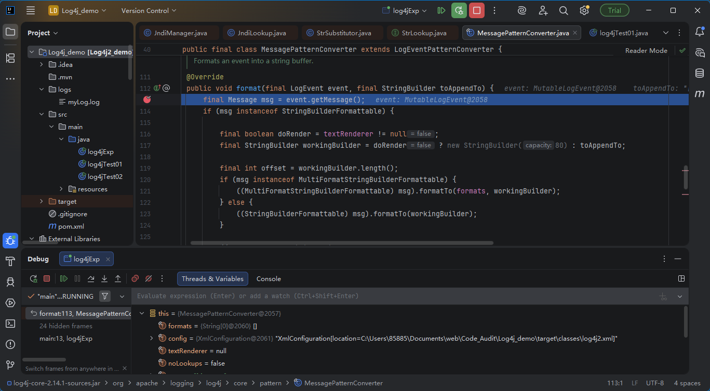
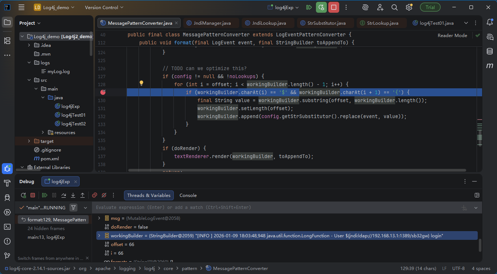
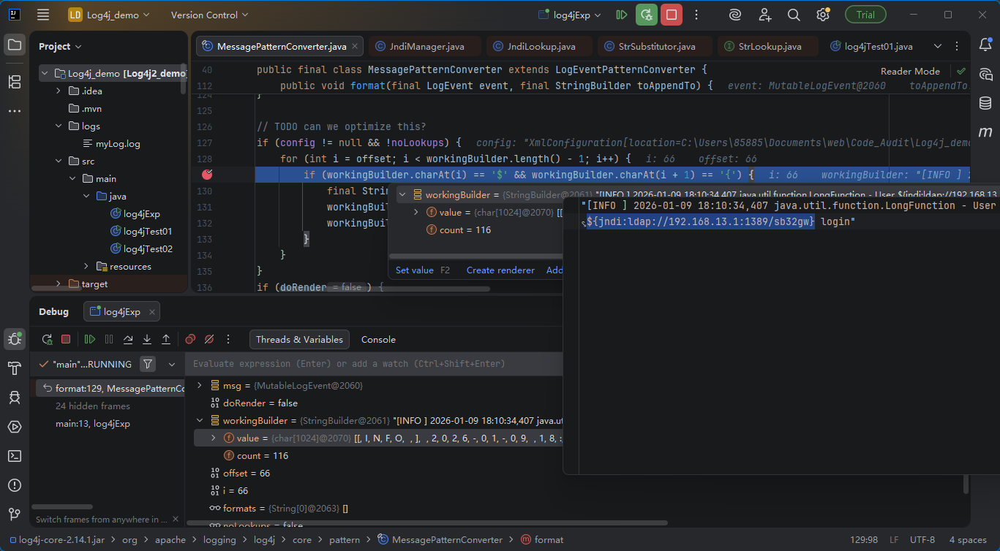

source

javax.naming.InitialContext#lookup

sink

source

log4j.error

log4j.info

payload

${jndi:ldap:}

以漏洞挖掘的角度分析链

搜索漏洞执行点lookup-》JndiManager

JndiManager.lookup() = this.context.lookup() = InitialContext.lookup()

完整链子

log4j.error/log4j.info

->MessagePatternConverter.format

->StrSubstitutor.replace

->StrSubstitutor.substitute

->StrSubstitutor.resolveVariable()

->JndiLookup.lookup()

->JndiManager.lookup()

## 链分析

前面是日志的调用过程，logger.info和logger.error最后都会进入`MessagePatternConverter.format`所以直接从这开始跟链

往下走便是为什么payload要带`${`，因为这里有个if判断会`workingBuilder`中`${`之后的内容

可以看到value的值就是payload

然后进入`StrSubstitutor.replace`

接着调用`StrSubstitutor.substitute`

往下走到while循环会获取${}中的内容

